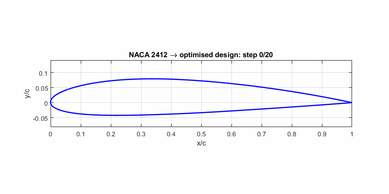
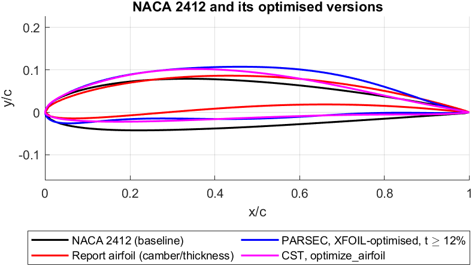
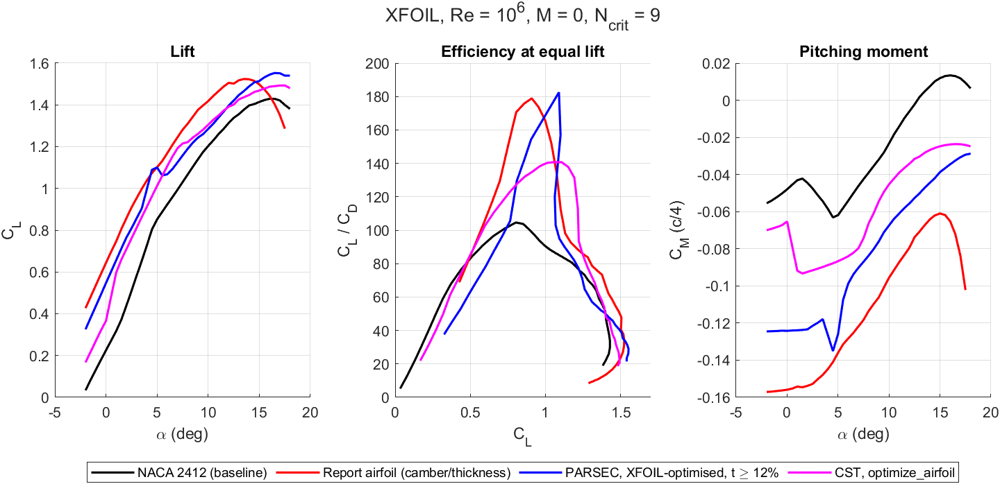
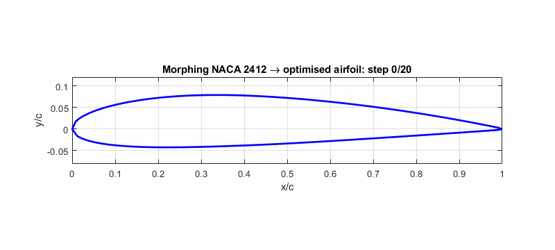

# Airfoil Geometry Optimization (NACA 2412)

MATLAB code and results of a 4th-semester aeronautical engineering mini project (2024–25):
optimisation of the NACA 2412 airfoil with a hybrid **Genetic Algorithm + Nonlinear Programming
(fmincon)** search, a **morphing** sequence from the baseline to the optimised shape, and `.dat` export
for **XFLR5**.

The project report used a geometric objective (camber/thickness) and analysed the result in XFLR5
afterwards. This repository also runs **XFOIL inside the optimisation loop**, so the optimiser
maximises lift-to-drag directly. The resulting airfoil has a **74 % higher peak lift-to-drag ratio than
NACA 2412 at the same 12 % thickness**. The same approach is packaged as `optimize_airfoil`, which
takes any airfoil.



## Results

All airfoils analysed with XFOIL under the same conditions: Re = 10⁶, M = 0, Ncrit = 9, α = −2° to 18°.

| Airfoil | t/c | Peak CL/CD (α) | Peak CL^1.5/CD | CL,max (α) | CM at α = 0° |
|---|---:|---:|---:|---:|---:|
| NACA 2412 (baseline) | 12.0 % | 104.6 (4.5°) | 95.7 | 1.43 (16.0°) | −0.048 |
| Report airfoil: camber/thickness objective, ≈ NACA 5508 | 8.0 % | 178.9 (2.5°) | 170.6 | 1.52 (13.5°) | −0.156 |
| **PARSEC, XFOIL in the loop, t ≥ 12 %** | 12.3 % | **182.5 (4.5°)**, +74 % | **190.5**, +99 % | 1.55 (16.5°) | −0.124 |
| CST, `optimize_airfoil` (limits CM) | 12.0 % | 141.0 (5.5°), +35 % | 148.1, +55 % | 1.49 (17.5°) | −0.065 |





- **Most efficient: the PARSEC design.** It has the highest peak L/D and endurance factor and the
  same thickness as NACA 2412, and stalls later with more lift. The optimiser moved the maximum
  thickness from 30 % to 44 % chord and raised the camber from 2 % to 4.6 %, with its peak at 52 %
  chord. The price is a nose-down pitching moment about 2.6 times that of NACA 2412 and a narrow
  high-efficiency range: at CL = 0.5 it is worse than the baseline (table below).
- **The report airfoil comes close on peak L/D, but only because it is thinner.** At 8 % thickness it has
  a third less structural depth, the largest pitching moment and the earliest stall. The camber/thickness
  objective pushes every run to the thinnest, most cambered corner of the bounds, so this result comes
  from the chosen bounds, not from aerodynamics.
- **Most balanced: the CST design.** It is more efficient than NACA 2412 over most of the lift range
  (CL ≈ 0.5 to 1.35) and the best of the four at CL = 0.5 and 1.2. Its pitching moment grew by only
  0.02 because `optimize_airfoil` constrains it.

Efficiency at equal lift, which is what a wing flying at a given weight and speed sees
([ld_at_cl.csv](results/xfoil/ld_at_cl.csv)):

| CL/CD at | CL = 0.5 | CL = 0.8 | CL = 1.0 | CL = 1.2 |
|---|---:|---:|---:|---:|
| NACA 2412 | 83.0 | 104.5 | 90.4 | 78.5 |
| Report airfoil | 84.6 | **168.7** | 165.1 | 89.8 |
| PARSEC, t ≥ 12 % | 63.1 | 124.5 | **168.9** | 80.5 |
| CST, `optimize_airfoil` | **85.2** | 126.7 | 139.8 | **125.3** |

Every approach tried during the project, ranked the same way:
[approach comparison](results/xfoil/approach_comparison.png),
[table](results/xfoil/approach_comparison.csv). Details are in [results/README.md](results/README.md).

## Optimise any airfoil

```matlab
cd MATLAB/Optimization
r = optimize_airfoil('NACA 2412');                     % NACA 4-digit code
r = optimize_airfoil('myfoil.dat');                    % any Selig or Lednicer .dat file
r = optimize_airfoil('myfoil.dat', 'Re', 5e5, 'Objective', 'endurance');
```

The airfoil is fitted with a CST (class-shape transformation) parameterisation, which can describe
almost any airfoil. A GA and then fmincon change the shape to maximise the XFOIL objective. The airfoil
may not get thinner than the original, and its pitching moment may not grow by more than a set
amount. The result is written as an XFLR5-compatible `.dat` file together with both polars and a
before/after table. Options are listed in [MATLAB/Optimization](MATLAB/Optimization/README.md).

Results with the default options (XFOIL, Re = 10⁶; details in [results/README.md](results/README.md)):

| Airfoil | Peak CL/CD | Peak CL^1.5/CD | CM at 0° |
|---|---|---|---|
| NACA 0012 | 76.5 → 123.7 (+62 %) | 76.0 → 117.6 (+55 %) | 0.000 → −0.027 |
| NACA 2412 | 104.6 → 140.8 (+35 %) | 95.7 → 148.1 (+55 %) | −0.048 → −0.065 |
| NACA 4412 | 129.6 → 168.5 (+30 %) | 133.6 → 172.0 (+29 %) | −0.096 → −0.131 |

All three keep their thickness. A run takes 30–50 minutes on 8 cores.

## The report method

```
NACA 2412  ->  design variables [m p t]  ->  GA (global)  ->  fmincon (local)  ->  optimised airfoil
                                                                                      |
                              morphing sequence (21 .dat files)  <--------------------+
                                                                                      |
                                              XFLR5 analysis: CL, CD, CL/CD vs alpha <-+
```

- **Geometry:** NACA 4-digit equations; `m` = maximum camber, `p` = its chordwise position,
  `t` = maximum thickness. Bounds: `0 ≤ m ≤ 0.05`, `0.2 ≤ p ≤ 0.6`, `0.08 ≤ t ≤ 0.15`.
- **Objective:** maximise camber/thickness, a geometric stand-in for lift-to-drag.
- **Optimiser:** `ga` (population 100, 100 generations), then `fmincon` (interior-point) from the GA result.
- **Result:** m = 0.050, p ≈ 0.52, t = 0.080 (roughly a NACA 5508), analysed afterwards in XFLR5.



XFLR5 results from the report:

| | NACA 2412 | Optimised | Change |
|---|---:|---:|---:|
| CL at α = 0° | 0.247 | 0.591 | +139 % |
| CD at α = 0° | 0.00572 | 0.00564 | −1.4 % |
| CL/CD at α = 0° | 43.2 | 104.8 | **+142.6 %** |
| Peak CL/CD (read from the polar plot) | ≈ 100 at α ≈ 4–5° | ≈ 160 at α ≈ 2° | ≈ **+55–60 %** |
| CL,max | 1.549 at 16° | 1.531 at 13.3° | −1.1 %, stall 2.7° earlier |

The +142.6 % applies only at α = 0°. The fair comparison is peak to peak, which XFOIL puts at +71 %.

Limitations of the report method:

- The optimum lies on the bounds. Camber/thickness always increases with more camber and less
  thickness, so every run ends at `m` = upper bound and `t` = lower bound, and `p` depends on the GA's
  random start ([objective landscape](results/figures/objective_landscape.png),
  [5-seed runs](results/ga_nlp_seeds.csv)). The XFOIL-in-the-loop optimisation removes this problem.
- Only 2-D sections are compared. Reynolds-number effects, structure and 3-D effects are not included.
- The morphing is a geometric interpolation. No mechanism, skin or actuation is modelled.

## Repository layout

```
MATLAB/
  NACA2412/       naca4.m (geometry), writeAirfoilDat.m (XFLR5 export), naca2412_baseline.m
  PARSEC/         PARSEC parameterisation (parsec.m, parsecSurfaces.m ...), fit_parsec_naca2412.m
  Aerodynamics/   XFOIL wrapper (xfoilPolar.m), efficiency metrics, readAirfoil.m,
                  compare_approaches.m, plot_polars.m
  Optimization/   optimize_airfoil.m (any airfoil, CST + XFOIL), optimize_xfoil_parsec.m,
                  optimize_xfoil_naca.m, optimize_naca_ga_nlp.m (report method), run_parsec_ga.m
  Morphing/       morph_airfoil.m (report morph), morph_to_design.m (morph to any .dat, with L/D per step)
  run_project.m   runs everything in order
  make_report_figures.m
results/
  xfoil/          XFOIL comparison: optimised airfoils (.dat), polars (.csv), figures
  optimize_airfoil/  NACA 0012 and NACA 4412 optimised with optimize_airfoil
  morph_sequence/ the 21 .dat files analysed in XFLR5 for the report
  airfoils/       baseline and report airfoil (.dat)
  figures/        figures of the report method
```

## Running the code

Requirements: MATLAB R2020b or newer, Optimization Toolbox, Global Optimization Toolbox, and for the
aerodynamic steps XFOIL 6.99 ([setup](MATLAB/Aerodynamics/README.md): download `xfoil.exe` from MIT and
put it in `MATLAB/Aerodynamics`). Parallel Computing Toolbox is optional and speeds up the XFOIL
optimisations.

```matlab
cd MATLAB
run_project                                   % everything; XFOIL steps are skipped without XFOIL
```

or step by step:

```matlab
run NACA2412/naca2412_baseline.m              % baseline geometry and .dat
run Optimization/optimize_naca_ga_nlp.m       % report method (5 seeds)
run Morphing/morph_airfoil.m                  % report morph: 21 .dat files, AVI, GIF
run PARSEC/fit_parsec_naca2412.m              % PARSEC fit of NACA 2412
run Optimization/run_parsec_ga.m              % PARSEC + GA (area-based reference method)
run Optimization/optimize_xfoil_parsec.m      % XFOIL in the loop, PARSEC (the recommended design)
run Optimization/optimize_xfoil_naca.m        % XFOIL in the loop, NACA [m p t]
run Aerodynamics/compare_approaches.m         % every approach analysed with the same settings
run Morphing/morph_to_design.m                % morph to the PARSEC design with L/D per step
```

Outputs are written to `MATLAB/output/` (not tracked). Each XFOIL optimisation takes about
10–50 minutes on 8 cores. To analyse an
airfoil in XFLR5, open its `.dat` file (File → Open). XFLR5 accepts at most 300 points per foil; the
exported files have 199–299.

## Development history

The project started as an adaptive morphing-wing study (subsonic ↔ supersonic airfoils) and was
narrowed down over several attempts:

| Approach | Outcome |
|---|---|
| NACA 6A-412 / 63(1)-412 with Bezier camber lines | dropped: no validated reference geometry |
| UAS-S45 airfoil in Bezier–PARSEC form (Bashir et al.) | dropped: the published geometry could not be reproduced |
| PARSEC + genetic algorithm (El Houd & Hallou) | kept as a reference branch (area-based fitness) |
| PARSEC + fmincon | dropped: ill-conditioned PARSEC systems |
| 8-parameter NACA-type GA/NLP | dropped: no feasible designs |
| GA + PSO + fmincon on NACA parameters | dropped: a sign error made it minimise camber (symmetric airfoils) |
| **NACA [m p t] + GA → fmincon + morphing** | **method of the report** |
| PARSEC / CST + GA → fmincon with XFOIL in the loop | added in this repository; best results |

Many early `.dat` files would not load in XFLR5 because they had about 400 points; XFLR5 allows at
most 300.

## Credits

- The PARSEC and GA routines (`MATLAB/PARSEC`, `GAairfoil.m`, `randp.m`) come from the reference study
  A. El Houd and Y. Hallou, *Optimization study of NACA airfoil using nonlinear programming & genetic
  algorithms*, Bachelor's thesis, 2022. They were corrected for this repository; see the header of
  `parsec.m`.
- The morphing-airfoil idea draws on M. Bashir, S. Longtin-Martel, R. M. Botez and T. Wong,
  *Aerodynamic Design Optimization of a Morphing Leading Edge and Trailing Edge Airfoil–Application on
  the UAS-S45*, Applied Sciences 11(4):1664, 2021.
- CST parameterisation: B. M. Kulfan, *Universal parametric geometry representation method*, Journal of
  Aircraft 45(1), 2008.
- XFOIL: M. Drela, MIT (<https://web.mit.edu/drela/Public/web/xfoil/>). XFOIL is not distributed with
  this repository.
