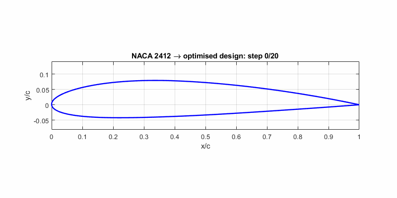
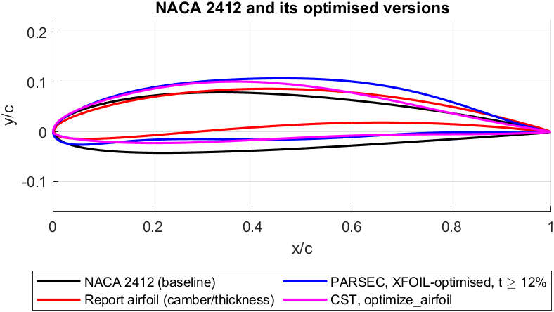
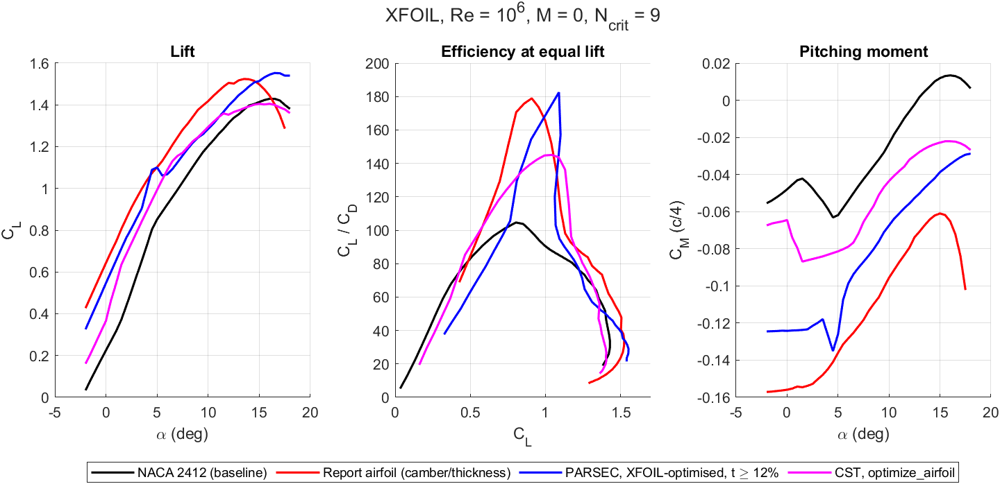
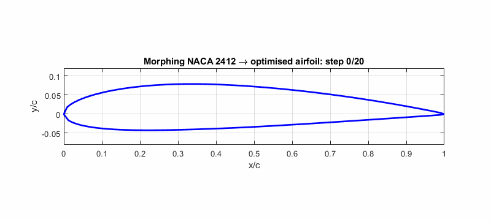

# Airfoil Geometry Optimization (NACA 2412)

MATLAB code and results of a 4th-semester aeronautical engineering mini project (2024–25):
optimisation of the NACA 2412 airfoil with a hybrid **Genetic Algorithm + Nonlinear Programming
(fmincon)** search, a **morphing** sequence from the baseline to the optimised shape, and `.dat` export
for **XFLR5**.

The project report used a geometric objective (camber/thickness) and analysed the result in XFLR5
afterwards. This repository also runs **XFOIL inside the optimisation loop**, so the optimiser
maximises lift-to-drag directly; the approach is packaged as `optimize_airfoil`, which takes any
airfoil. With smooth shapes (curvature limits) and three random seeds, it raises the **peak
lift-to-drag ratio of NACA 2412 by 33 % on average at the same thickness** (XFOIL, Re = 10⁶; see
[results/paper](results/paper/README.md)). An earlier PARSEC design reached +74 %, but its surface is
wavy and its advantage drops to +36 % when transition occurs earlier (Ncrit = 5), so part of it may be
an XFOIL artefact.



## Results

All airfoils analysed with XFOIL under the same conditions: Re = 10⁶, M = 0, Ncrit = 9, α = −2° to 18°.

| Airfoil | t/c | Peak CL/CD (α) | Peak CL^1.5/CD | CL,max (α) | CM at α = 0° |
|---|---:|---:|---:|---:|---:|
| NACA 2412 (baseline) | 12.0 % | 104.6 (4.5°) | 95.7 | 1.43 (16.0°) | −0.048 |
| Report airfoil: camber/thickness objective, ≈ NACA 5508 | 8.0 % | 178.9 (2.5°) | 170.6 | 1.52 (13.5°) | −0.156 |
| **PARSEC, XFOIL in the loop, t ≥ 12 %** | 12.3 % | **182.5 (4.5°)**, +74 % | **190.5**, +99 % | 1.55 (16.5°) | −0.124 |
| CST, `optimize_airfoil` (limits CM) | 12.0 % | 145.0 (5.5°), +39 % | 149.8, +57 % | 1.41 (16.0°) | −0.065 |





- **Most efficient: the PARSEC design.** It has the highest peak L/D and endurance factor and the
  same thickness as NACA 2412, and stalls later with more lift. The optimiser moved the maximum
  thickness from 30 % to 44 % chord and raised the camber from 2 % to 4.6 %, with its peak at 52 %
  chord. The price is a nose-down pitching moment about 2.6 times that of NACA 2412 and a narrow
  high-efficiency range: at CL = 0.5 it is worse than the baseline (table below).
- **The report airfoil comes close on peak L/D, but only because it is thinner.** At 8 % thickness it has
  a third less structural depth, the largest pitching moment and the earliest stall. The camber/thickness
  objective pushes every run to the thinnest, most cambered corner of the bounds, so this result comes
  from the chosen bounds, not from aerodynamics.
- **Most balanced: the CST design.** It is more efficient than NACA 2412 over most of the lift range
  (CL ≈ 0.45 to 1.3) and the best of the four at CL = 0.5. Its pitching moment grew by only 0.02
  because `optimize_airfoil` constrains it; without that limit it reaches 166.8 (see below).

Efficiency at equal lift, which is what a wing flying at a given weight and speed sees
([ld_at_cl.csv](results/xfoil/ld_at_cl.csv)):

| CL/CD at | CL = 0.5 | CL = 0.8 | CL = 1.0 | CL = 1.2 |
|---|---:|---:|---:|---:|
| NACA 2412 | 83.0 | 104.5 | 90.4 | 78.5 |
| Report airfoil | 84.6 | **168.7** | 165.1 | **89.8** |
| PARSEC, t ≥ 12 % | 63.1 | 124.5 | **168.9** | 80.5 |
| CST, `optimize_airfoil` | **90.4** | 130.6 | 144.8 | 89.1 |

Every approach tried during the project, ranked the same way:
[approach comparison](results/xfoil/approach_comparison.png),
[table](results/xfoil/approach_comparison.csv). Details are in [results/README.md](results/README.md).

## Optimise any airfoil

```matlab
cd MATLAB/Optimization
r = optimize_airfoil('NACA 2412');                     % NACA 4-digit code
r = optimize_airfoil('NACA 23012');                    % NACA 5-digit code
r = optimize_airfoil('myfoil.dat');                    % any Selig or Lednicer .dat file
r = optimize_airfoil('myfoil.dat', 'Re', 5e5, 'Objective', 'endurance');
```

The airfoil is fitted with a CST (class-shape transformation) parameterisation, which can describe
almost any airfoil. A GA and then fmincon change the shape to maximise the XFOIL objective. The airfoil
may not get thinner than the original, and its pitching moment may not grow by more than a set
amount. The result is written as an XFLR5-compatible `.dat` file together with both polars and a
before/after table. Options are listed in [MATLAB/Optimization](MATLAB/Optimization/README.md).

Results with the default options (XFOIL, Re = 10⁶; details in [results/README.md](results/README.md)):

| Airfoil | Peak CL/CD | Peak CL^1.5/CD | CM at 0° |
|---|---|---|---|
| NACA 0012 | 76.5 → 123.7 (+62 %) | 76.0 → 117.6 (+55 %) | 0.000 → −0.027 |
| NACA 2412 | 104.6 → 145.0 (+39 %) | 95.7 → 149.8 (+57 %) | −0.048 → −0.065 |
| NACA 4412 | 129.6 → 168.5 (+30 %) | 133.6 → 172.0 (+29 %) | −0.096 → −0.131 |
| NACA 23012 | 98.9 → 133.9 (+35 %) | 104.3 → 135.1 (+29 %) | −0.003 → −0.034 |

All keep their thickness. Without the pitching-moment limit (`'CmIncrease', Inf`), NACA 2412 reaches
166.8 (+59 %), 91 % of the PARSEC design. A run takes 30–50 minutes on 8 cores.

These runs were made before the curvature limits. With the limits and three random seeds each
([results/paper](results/paper/README.md)), the mean gains in peak CL/CD are: NACA 0012 +52 %,
NACA 2412 +33 %, NACA 4412 +29 %, NACA 23012 +32 %, Clark Y +50 %.

### Further results

- **More seeds and options.** Clark Y improves by +49 %. A particle swarm → pattern search option
  gives the same result as GA → fmincon. The tool also optimises for cruise, loiter, a weighted
  combination, or with maximum lift kept.
- **Benchmark.** With smooth shapes on both sides, `optimize_airfoil` and Xoptfoil2 reach the same
  result on the same task (mean weighted objective 121.9 against 122.2 over three runs each), and
  Xoptfoil2 is about 20 times faster. An earlier comparison, in which our designs were wavy, had shown a
  9 % advantage for `optimize_airfoil`; that advantage came from the waviness.
- **Smooth shapes.** The designs in the tables above have slightly wavy surfaces. `optimize_airfoil` now
  applies curvature limits by default ([details](MATLAB/Optimization/README.md#curvature-limits)), and
  all runs were repeated with them and three random seeds: [results/paper](results/paper/README.md). On
  NACA 2412 the limits cost about 4 % of peak lift-to-drag.
- **The gains depend on laminar flow.** With boundary layers tripped at 5 % chord, XFOIL rates the
  optimised NACA 2412 designs below the original ([results/cfd](results/cfd/README.md)). A lower Ncrit
  alone does not remove the gain of the smooth design.
- **A formulation that keeps the gain.** Optimising the mean of the peak CL/CD with free transition and
  with tripped boundary layers keeps a gain of 25 to 32 % with free transition and loses nothing when
  tripped ([results/population](results/population/README.md)). That study, the same optimisation for
  30 airfoils, is still running.
- **CFD.** The Fluent set-up is verified on NASA's NACA 0012 case: lift within 1.2 % and drag within
  6.4 % of each of NASA's three reference codes, skin friction within 1.2 % of CFL3D
  ([results/cfd](results/cfd/README.md)). The RANS runs of the NACA 2412 designs are in progress.
- **Validation.** Against NACA 0012 wind-tunnel data (Ladson 1988), XFOIL's drag agrees within 3 % when
  transition is fixed at 5 % chord, but is 11–14 % too low with free transition, and its maximum lift is
  too high. Absolute L/D values from XFOIL are therefore optimistic; see
  [results/validation](results/validation/README.md).
- **Morphing.** Morphing between a cruise and a loiter shape beats any fixed airfoil at the two ends of
  the lift range. Nose and trailing-edge morphing with a fixed wing box raises the loiter
  efficiency of NACA 2412 by 84 %.

Details are in [results/README.md](results/README.md).

## The report method

```
NACA 2412  ->  design variables [m p t]  ->  GA (global)  ->  fmincon (local)  ->  optimised airfoil
                                                                                      |
                              morphing sequence (21 .dat files)  <--------------------+
                                                                                      |
                                              XFLR5 analysis: CL, CD, CL/CD vs alpha <-+
```

- **Geometry:** NACA 4-digit equations; `m` = maximum camber, `p` = its chordwise position,
  `t` = maximum thickness. Bounds: `0 ≤ m ≤ 0.05`, `0.2 ≤ p ≤ 0.6`, `0.08 ≤ t ≤ 0.15`.
- **Objective:** maximise camber/thickness, a geometric stand-in for lift-to-drag.
- **Optimiser:** `ga` (population 100, 100 generations), then `fmincon` (interior-point) from the GA result.
- **Result:** m = 0.050, p ≈ 0.52, t = 0.080 (roughly a NACA 5508), analysed afterwards in XFLR5.



XFLR5 results from the report:

| | NACA 2412 | Optimised | Change |
|---|---:|---:|---:|
| CL at α = 0° | 0.247 | 0.591 | +139 % |
| CD at α = 0° | 0.00572 | 0.00564 | −1.4 % |
| CL/CD at α = 0° | 43.2 | 104.8 | **+142.6 %** |
| Peak CL/CD (read from the polar plot) | ≈ 100 at α ≈ 4–5° | ≈ 160 at α ≈ 2° | ≈ **+55–60 %** |
| CL,max | 1.549 at 16° | 1.531 at 13.3° | −1.1 %, stall 2.7° earlier |

The +142.6 % applies only at α = 0°. The fair comparison is peak to peak, which XFOIL puts at +71 %.

Limitations of the report method:

- The optimum lies on the bounds. Camber/thickness always increases with more camber and less
  thickness, so every run ends at `m` = upper bound and `t` = lower bound, and `p` depends on the GA's
  random start ([objective landscape](results/figures/objective_landscape.png),
  [5-seed runs](results/ga_nlp_seeds.csv)). The XFOIL-in-the-loop optimisation removes this problem.
- Only 2-D sections are compared. Reynolds-number effects, structure and 3-D effects are not included.
- The morphing is a geometric interpolation. No mechanism, skin or actuation is modelled.

## Repository layout

```
MATLAB/
  NACA2412/       naca4.m, naca5.m (geometry), writeAirfoilDat.m (XFLR5 export), naca2412_baseline.m
  PARSEC/         PARSEC parameterisation (parsec.m, parsecSurfaces.m ...), fit_parsec_naca2412.m
  Aerodynamics/   XFOIL wrapper (xfoilPolar.m), efficiency metrics, readAirfoil.m,
                  compare_approaches.m, plot_polars.m
  Optimization/   optimize_airfoil.m (any airfoil, CST + XFOIL), optimize_xfoil_parsec.m,
                  optimize_xfoil_naca.m, optimize_naca_ga_nlp.m (report method), run_parsec_ga.m
  Morphing/       morph_airfoil.m (report morph), morph_to_design.m (morph to any .dat, with L/D per step)
  Validation/     validate_xfoil.m: XFOIL against NACA 0012 wind-tunnel data
  Paper/          run_paper_batch.m (the 37 runs), collect_paper_results.m, benchmark and sensitivity,
                  run_population_study.m (the same optimisation for 30 airfoils)
  CFD/            C-grid generator, Fluent journals and batch runner, verification on NASA's
                  NACA 0012 case, design study, post-processing
  airfoils/       seed airfoils as .dat files (Clark Y)
  run_project.m   runs everything in order
  make_report_figures.m
results/
  xfoil/          XFOIL comparison: optimised airfoils (.dat), polars (.csv), figures
  optimize_airfoil/  optimize_airfoil results: other airfoils, options and flight phases
  xoptfoil2/      benchmark against Xoptfoil2
  morphing/       morphing envelope and nose/trailing-edge morphing
  validation/     XFOIL against wind-tunnel data (experimental data, polars, comparison)
  paper/          smooth-shape results with three random seeds (basis of the planned paper)
  cfd/            Fluent: verification on NASA's NACA 0012 case, time-step study, design study
  population/     the same optimisation for 30 airfoils (in progress); robust formulations for NACA 2412
  morph_sequence/ the 21 .dat files analysed in XFLR5 for the report
  airfoils/       baseline and report airfoil (.dat)
  figures/        figures of the report method
docs/
  methods.md      the methods, with every setting as it is in the code
  literature.md   references, documented search, audit of reporting practice, research gaps
  literature/     search and audit scripts and their tables
  paper_outline.md  working outline of the planned paper
tools/
  check_numbers.py  checks numbers in the documents against the result files (numbers.csv)
LICENSE           MIT licence
THIRD_PARTY_NOTICES.md   code and data from other sources and their terms
```

## Running the code

Requirements: MATLAB R2021a or newer (tested with R2024b), Optimization Toolbox, Global Optimization
Toolbox, and for the aerodynamic steps XFOIL 6.99 ([setup](MATLAB/Aerodynamics/README.md): download `xfoil.exe` from MIT and
put it in `MATLAB/Aerodynamics`). Parallel Computing Toolbox is optional and speeds up the XFOIL
optimisations.

```matlab
cd MATLAB
run_project                                   % everything; XFOIL steps are skipped without XFOIL
```

or step by step:

```matlab
run NACA2412/naca2412_baseline.m              % baseline geometry and .dat
run Optimization/optimize_naca_ga_nlp.m       % report method (5 seeds)
run Morphing/morph_airfoil.m                  % report morph: 21 .dat files, AVI, GIF
run PARSEC/fit_parsec_naca2412.m              % PARSEC fit of NACA 2412
run Optimization/run_parsec_ga.m              % PARSEC + GA (area-based reference method)
run Optimization/optimize_xfoil_parsec.m      % XFOIL in the loop, PARSEC (the recommended design)
run Optimization/optimize_xfoil_naca.m        % XFOIL in the loop, NACA [m p t]
run Aerodynamics/compare_approaches.m         % every approach analysed with the same settings
run Morphing/morph_to_design.m                % morph to the PARSEC design with L/D per step
validate_xfoil                                % in MATLAB/Validation: XFOIL against wind-tunnel data
```

Outputs are written to `MATLAB/output/` (not tracked). Each XFOIL optimisation takes about
10–50 minutes on 8 cores. To analyse an
airfoil in XFLR5, open its `.dat` file (File → Open). XFLR5 accepts at most 300 points per foil; the
exported files have 199–299.

## Development history

The project started as an adaptive morphing-wing study (subsonic ↔ supersonic airfoils) and was
narrowed down over several attempts:

| Approach | Outcome |
|---|---|
| NACA 6A-412 / 63(1)-412 with Bezier camber lines | dropped: no validated reference geometry |
| UAS-S45 airfoil in Bezier–PARSEC form (Bashir et al.) | dropped: the published geometry could not be reproduced |
| PARSEC + genetic algorithm (El Houd & Hallou) | kept as a reference branch (area-based fitness) |
| PARSEC + fmincon | dropped: ill-conditioned PARSEC systems |
| 8-parameter NACA-type GA/NLP | dropped: no feasible designs |
| GA + PSO + fmincon on NACA parameters | dropped: a sign error made it minimise camber (symmetric airfoils) |
| **NACA [m p t] + GA → fmincon + morphing** | **method of the report** |
| PARSEC / CST + GA → fmincon with XFOIL in the loop | added in this repository; best results |

Many early `.dat` files would not load in XFLR5 because they had about 400 points; XFLR5 allows at
most 300.

## Credits

- The PARSEC and GA routines (`parsec.m`, `yCoord2.m`, `airenaca.m`, `plotairfoil.m` and
  `exportAirfoilDat.m` in `MATLAB/PARSEC`; `GAairfoil.m`, `randp.m` and `run_parsec_ga.m` in
  `MATLAB/Optimization`) come from the reference implementation of A. El Houd and Y. Hallou,
  *Optimization study of NACA airfoil using nonlinear programming & genetic algorithms*, project report,
  ENSAM Meknès, Morocco, 2019 (<https://github.com/anasselhoud/Airfoil-Shape_optimization>, MIT licence).
  `parsec.m` was corrected for this repository (see its header); the changes to the other files are
  listed in [THIRD_PARTY_NOTICES.md](THIRD_PARTY_NOTICES.md).
- The morphing-airfoil idea draws on M. Bashir, S. Longtin-Martel, R. M. Botez and T. Wong,
  *Aerodynamic Design Optimization of a Morphing Leading Edge and Trailing Edge Airfoil–Application on
  the UAS-S45*, Applied Sciences 11(4):1664, 2021.
- CST parameterisation: B. M. Kulfan, *Universal parametric geometry representation method*, Journal of
  Aircraft 45(1), 2008.
- XFOIL: M. Drela, MIT (<https://web.mit.edu/drela/Public/web/xfoil/>). XFOIL is not distributed with
  this repository.
- Curvature limits: J. Guenzel, Xoptfoil2 (<https://github.com/jxjo/Xoptfoil2>).
- Wind-tunnel data: C. L. Ladson, NASA TM-4074, 1988, and the NASA Langley Turbulence Modeling
  Resource; see [results/validation/experimental](results/validation/experimental/README.md).

## Licence

The code is released under the [MIT licence](LICENSE). Code and data from other sources keep their
own terms; see [THIRD_PARTY_NOTICES.md](THIRD_PARTY_NOTICES.md).
