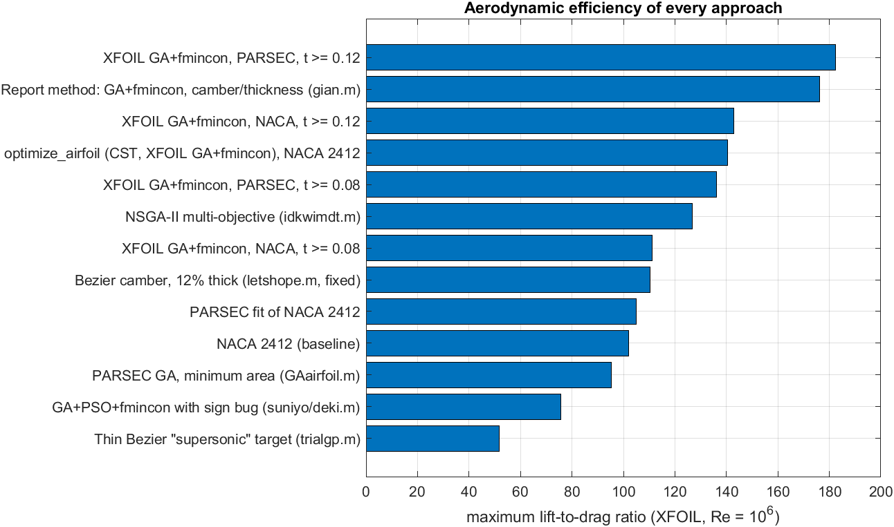
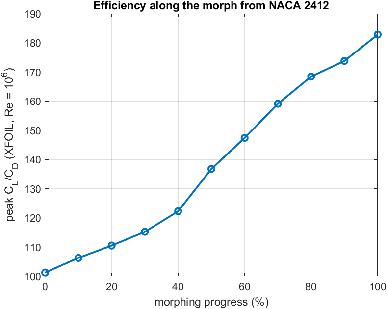

# Results

## XFOIL comparison of all approaches (`xfoil/`)

The final airfoil of every approach tried during the project was analysed with the same XFOIL
settings: Re = 10⁶, M = 0, Ncrit = 9, re-panelled, α = −2° to 18° in 0.5° steps
(`MATLAB/Aerodynamics/compare_approaches.m`). Peak values are taken from a 3-point moving median, so a
single spurious XFOIL point cannot set them.

| Approach | t/c | Peak CL/CD (α) | Peak CL^1.5/CD | CL,max (α) | CM at 0° |
|---|---:|---:|---:|---:|---:|
| **XFOIL GA + fmincon, PARSEC, t ≥ 0.12** (`optimize_xfoil_parsec.m`) | 0.123 | **182.5** (4.0°) | **187.0** | 1.553 (16.5°) | −0.124 |
| Report method: GA + fmincon, camber/thickness (`gian.m`) | 0.080 | 176.1 (2.0°) | 169.3 | 1.547 (13.5°) | −0.150 |
| XFOIL GA + fmincon, NACA [m p t], t ≥ 0.12 (`optimize_xfoil_naca.m`) | 0.127 | 143.0 (3.5°) | 145.4 | 1.649 (17.0°) | −0.131 |
| `optimize_airfoil('NACA 2412')`, CST + XFOIL | 0.121 | 140.5 (5.5°) | 147.9 | 1.493 (17.5°) | −0.065 |
| XFOIL GA + fmincon, PARSEC, t ≥ 0.08 \* | 0.081 | 136.1 (2.0°) | 132.4 | 1.741 (15.5°) | −0.184 |
| NSGA-II multi-objective (`idkwimdt.m`) \* | 0.080 | 126.9 (1.0°) | 107.3 | 0.736 (1.0°) | −0.152 |
| XFOIL GA + fmincon, NACA [m p t], t ≥ 0.08 \* | 0.080 | 111.1 (0.5°) | 88.1 | 0.651 (0.5°) | −0.144 |
| Bezier camber line, 12 % thick (`letshope.m`, fixed) | 0.120 | 110.5 (4.5°) | 105.7 | 1.483 (16.0°) | −0.056 |
| PARSEC fit of NACA 2412 | 0.120 | 104.9 (5.0°) | 99.9 | 1.404 (15.0°) | −0.046 |
| **NACA 2412 (baseline)** | 0.120 | **102.0** (4.5°) | **95.4** | 1.457 (15.5°) | −0.043 |
| PARSEC GA, minimum area (`GAairfoil.m`, reference method) | 0.101 | 95.3 (3.5°) | 99.1 | 1.705 (15.5°) | −0.115 |
| GA + PSO + fmincon with the sign error (`suniyo.m` / `deki.m`) | 0.130 | 75.6 (9.0°) | 79.0 | 1.341 (16.5°) | 0.000 |
| Thin Bezier "supersonic" target (`trialgp.m`) | 0.050 | 51.8 (1.0°) | 33.9 | 0.610 (5.5°) | −0.009 |

\* Not reliable. At 8 % thickness XFOIL's convergence is fragile: the PARSEC t ≥ 0.08 design scored
394.6 inside the optimiser but 136.1 when its saved file was re-analysed, and the other two polars end
at α ≈ 1°. These designs are left out of the conclusions.

What the comparison shows:

- **Putting XFOIL in the loop is what makes the difference.** The geometric objectives (camber/thickness,
  minimum area) either run to the bounds or do not target efficiency at all. The area-minimising PARSEC
  GA ends up below the baseline.
- **Shape freedom matters.** With the thickness held at 12 %, the best NACA 4-digit section (m = 0.050,
  p = 0.52, t = 0.127) reaches 143. PARSEC can also move the thickness peak and shape the rear of the
  section, which adds another 28 % (182.5).
- **The sign error explains the "no improvement" runs.** `suniyo.m` and `deki.m` minimised camber
  instead of maximising it and produced symmetric airfoils, 26 % worse than NACA 2412.
- **XFOIL's resolution.** The PARSEC fit of NACA 2412 differs from it by at most 0.003 c and scores 3 %
  higher, so differences of a few percent between airfoils are within XFOIL's scatter.

### Recommended design

**PARSEC, XFOIL-optimised, t ≥ 12 %**: [`NACA2412_parsec_t12_optimized.dat`](xfoil/NACA2412_parsec_t12_optimized.dat)

| r_le | x_up | y_up | y_xx,up | x_lo | y_lo | y_xx,lo | y_te | Δy_te | α_te | β_te |
|---:|---:|---:|---:|---:|---:|---:|---:|---:|---:|---:|
| 0.01622 | 0.45933 | 0.10751 | −0.52059 | 0.42516 | −0.01575 | 0.31189 | 0 | 0 | −2.710° | 13.003° |

Compared with NACA 2412: peak L/D +79 %, peak CL^1.5/CD +96 %, CL,max +6.5 % with stall 1° later, same
thickness (12.3 %, at 44 % chord instead of 30 %). Two things to consider before using it:

- The pitching moment at α = 0° is −0.124, three times that of NACA 2412, so the tail must trim a
  larger nose-down moment.
- The efficiency peak is narrow. At CL = 0.5 the airfoil is less efficient than NACA 2412 (63 against 83).

If these matter more than peak efficiency, the CST design from `optimize_airfoil`
([`NACA2412_cst_optimized.dat`](xfoil/NACA2412_cst_optimized.dat)) is the better choice: +38 % peak
L/D and +55 % CL^1.5/CD with a pitching moment of only −0.065, and more efficient than NACA 2412 from
CL ≈ 0.45 to 1.3.

| CL/CD at | CL = 0.3 | CL = 0.5 | CL = 0.8 | CL = 1.0 | CL = 1.2 |
|---|---:|---:|---:|---:|---:|
| NACA 2412 | 55.0 | 83.0 | 101.2 | 91.9 | 78.9 |
| Report airfoil | – | 84.2 | 157.1 | 164.2 | 90.0 |
| PARSEC, t ≥ 12 % | – | 63.1 | 123.8 | 172.4 | 80.3 |
| CST, `optimize_airfoil` | 45.9 | 88.5 | 126.7 | 139.9 | 124.6 |

(– : the airfoil does not reach that low a CL within α ≥ −2°.)

### Morphing to the recommended design

`MATLAB/Morphing/morph_to_design.m` blends NACA 2412 into the PARSEC design in 20 steps. The peak L/D
rises at every step analysed, from 101 to 183.

| | |
|---|---|
|  |  |

### Files

| File | Contents |
|---|---|
| `NACA2412_parsec_t12_optimized.dat` | Recommended airfoil (PARSEC, XFOIL-optimised, t ≥ 12 %) |
| `NACA2412_cst_optimized.dat` | Result of `optimize_airfoil('NACA 2412')` |
| `NACA2412_naca_t12_optimized.dat` | Best NACA 4-digit section with t ≥ 12 % (m = 0.050, p = 0.524, t = 0.127) |
| `polar_*.csv` | α, CL, CD, CM of NACA 2412, the report airfoil and the three designs above |
| `ld_at_cl.csv` | L/D at fixed lift coefficients |
| `approach_comparison.csv`, `approach_comparison.png`, `ld_polars.png` | All approaches ranked; L/D against α |
| `designs.png`, `polars.png` | Shapes; lift, L/D against CL and pitching moment |
| `NACA2412_cst_summary.csv`, `NACA2412_cst_comparison.png` | Before/after output of `optimize_airfoil` |
| `morph_to_design.gif`, `morph_efficiency.png`, `morph_efficiency.csv` | Morph to the PARSEC design with the peak L/D of every second step |

All `.dat` files are in Selig format with fewer than 300 points and open in XFLR5.

## Airfoils analysed in XFLR5 for the report

`morph_sequence/` holds the 21 files (steps 00–20) produced by the project run and analysed for the
report. Step 00 is the NACA 2412 baseline and step 20 is the optimised airfoil; the same two files
are in `airfoils/` with descriptive names.

| | m | p | t | camber/thickness |
|---|---:|---:|---:|---:|
| NACA 2412 (baseline) | 0.020 | 0.400 | 0.120 | 0.167 |
| Optimised | 0.050 | 0.516 | 0.080 | 0.627 |

The optimised parameters were recovered from the step-20 file by fitting the NACA equations to its
coordinates (rms error 4×10⁻⁷, i.e. rounding level). `MATLAB/NACA2412/naca4.m` reproduces the baseline
file byte for byte.

## Why the report's optimum sits on the bounds

The objective (camber/thickness) keeps increasing with camber and decreasing with thickness, so the
maximum is always the corner `m = 0.05`, `t = 0.08`. The GA + fmincon run was repeated with five random
seeds ([ga_nlp_seeds.csv](ga_nlp_seeds.csv)). Every run gives m = 0.050, t = 0.080 and camber/thickness
= 0.627, while `p` ends anywhere between 0.48 and 0.60 because it hardly affects the objective.

## XFLR5 results (from the project report)

| | NACA 2412 | Optimised | Change |
|---|---:|---:|---:|
| CL at α = 0° | 0.24713 | 0.59103 | +139.2 % |
| CD at α = 0° | 0.00572 | 0.00564 | −1.4 % |
| CL/CD at α = 0° | 43.20 | 104.79 | +142.6 % |
| CL at stall | 1.54895 (α = 16°) | 1.53146 (α = 13.3°) | −1.1 % |
| CL/CD at stall | 33.45 (α = 16°) | 38.96 (α = 13.3°) | different α, not comparable |

Notes on reading these numbers:

- **The α = 0° values are not the peak values.** The report's CL/CD polars show the baseline peaking at
  about 100 near α ≈ 4–5° and the optimised airfoil at about 160 near α ≈ 2°, roughly +55–60 % peak to
  peak (XFOIL: 102.0 → 176.1, +73 %). The +142.6 % applies only at α = 0°, where the extra camber
  raises the lift on its own.
- Above α ≈ 6° the baseline has the higher CL/CD, and the optimised airfoil stalls about 2.7° earlier
  with a slightly lower CL,max.
- The XFLR5 settings (Reynolds number, Mach number, Ncrit, panelling) were not recorded. The drag
  values suggest Re ≈ 10⁶. XFOIL at Re = 10⁶ gives the same drag and peak L/D for NACA 2412 but about
  0.04 less lift at 0°.
- The report did not evaluate the pitching moment. XFOIL gives CM = −0.150 at α = 0° for the optimised
  airfoil against −0.043 for NACA 2412.

| Baseline CL/CD vs α (report Fig. 4.4) | Optimised (blue) vs baseline (black) (report Fig. 4.8) |
|---|---|
|  |  |

The polar curves are noisy at negative angles of attack (XFOIL convergence); only the positive-α
part is used above.
