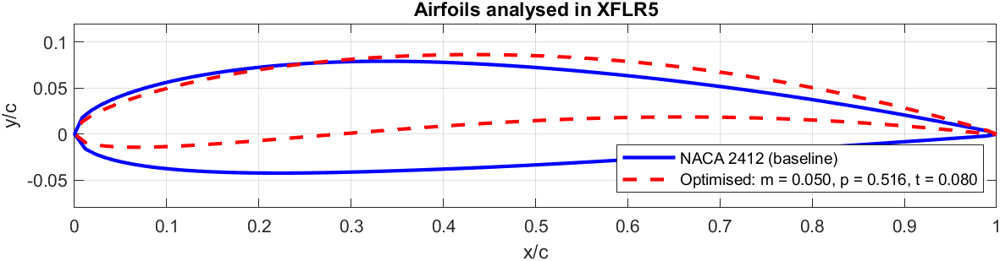
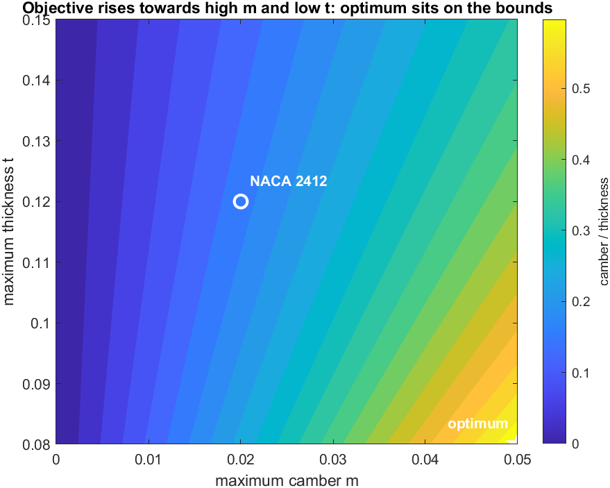
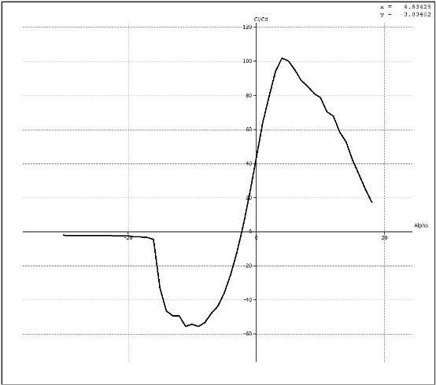
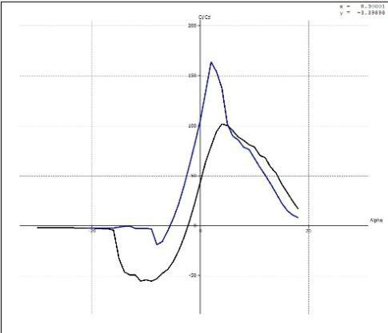

# Results

## Airfoils analysed in XFLR5

`morph_sequence/` holds the 21 files (steps 00–20) produced by the project run and analysed for the
report. Step 00 is the NACA 2412 baseline and step 20 is the optimised airfoil; the same two files
are in `airfoils/` with descriptive names.

| | m | p | t | camber/thickness |
|---|---:|---:|---:|---:|
| NACA 2412 (baseline) | 0.020 | 0.400 | 0.120 | 0.167 |
| Optimised | 0.050 | 0.516 | 0.080 | 0.627 |

The optimised parameters were recovered from the step-20 file by fitting the NACA equations to its
coordinates (rms error 4×10⁻⁷, i.e. rounding level). `MATLAB/NACA2412/naca4.m` reproduces the baseline
file byte for byte.

## Why the optimum sits on the bounds

The objective (camber/thickness) keeps increasing with camber and decreasing with thickness, so the
maximum is always the corner `m = 0.05`, `t = 0.08`. The GA + fmincon run was repeated with five random
seeds ([ga_nlp_seeds.csv](ga_nlp_seeds.csv)). Every run gives m = 0.050, t = 0.080 and camber/thickness
= 0.627, while `p` ends anywhere between 0.48 and 0.60 because it hardly affects the objective.

## XFLR5 results (from the project report)

| | NACA 2412 | Optimised | Change |
|---|---:|---:|---:|
| CL at α = 0° | 0.24713 | 0.59103 | +139.2 % |
| CD at α = 0° | 0.00572 | 0.00564 | −1.4 % |
| CL/CD at α = 0° | 43.20 | 104.79 | +142.6 % |
| CL at stall | 1.54895 (α = 16°) | 1.53146 (α = 13.3°) | −1.1 % |
| CL/CD at stall | 33.45 (α = 16°) | 38.96 (α = 13.3°) | different α, not comparable |

Notes on reading these numbers:

- **The α = 0° values are not the peak values.** The report's CL/CD polars show the baseline peaking at
  about 100 near α ≈ 4–5° and the optimised airfoil at about 160 near α ≈ 2°. Peak to peak, the
  improvement is roughly +55–60 %; the +142.6 % applies only at α = 0°. The extra camber shifts the
  zero-lift angle, which raises lift at 0° on its own.
- Above α ≈ 6° the baseline has the higher CL/CD, and the optimised airfoil stalls about 2.7° earlier
  with a slightly lower CL,max.
- The XFLR5 settings (Reynolds number, Mach number, Ncrit, panelling) were not recorded. The drag
  values suggest Re ≈ 10⁶. Record the settings when re-running the analysis.
- Pitching moment was not evaluated. The 5 % camber section will have a noticeably larger nose-down Cm
  than NACA 2412.

| Baseline CL/CD vs α (report Fig. 4.4) | Optimised (blue) vs baseline (black) (report Fig. 4.8) |
|---|---|
|  |  |

The polar curves are noisy at negative angles of attack (XFOIL convergence); only the positive-α
part is used above.
