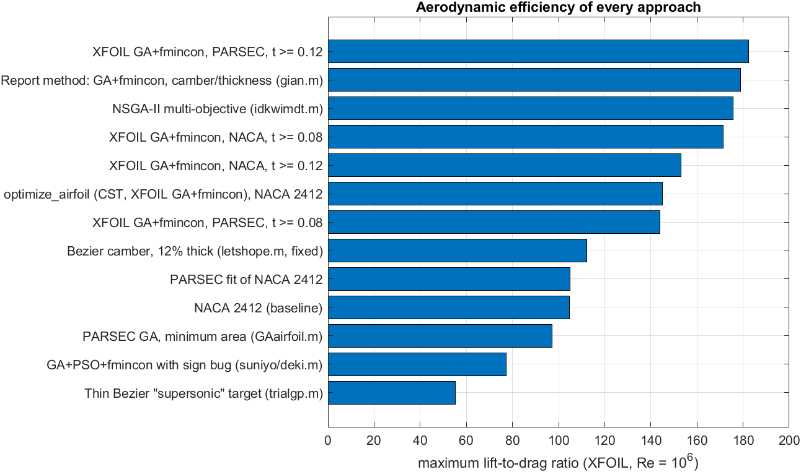
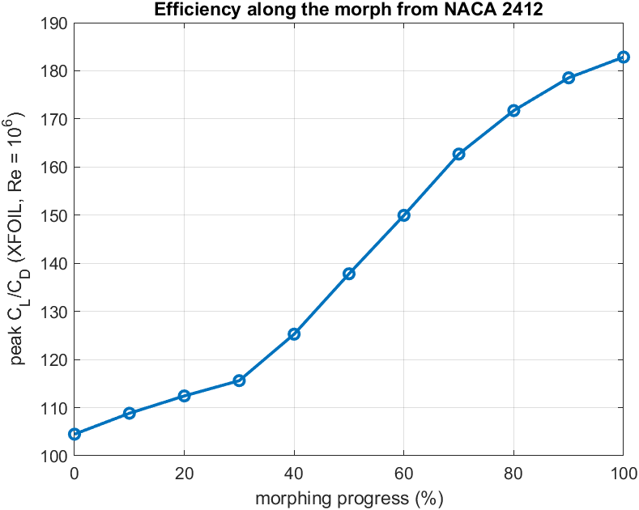
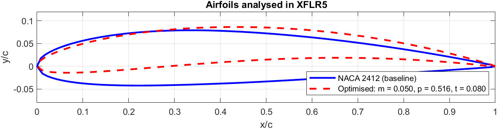
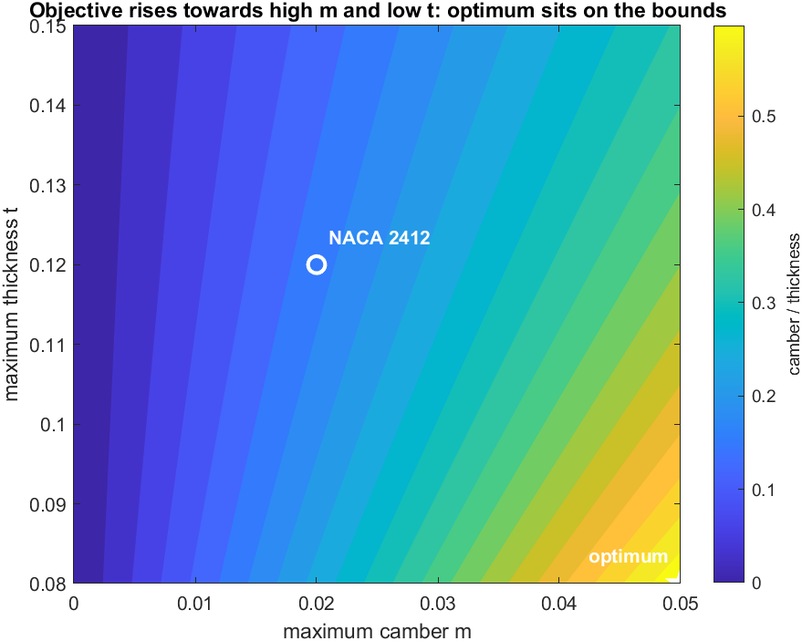
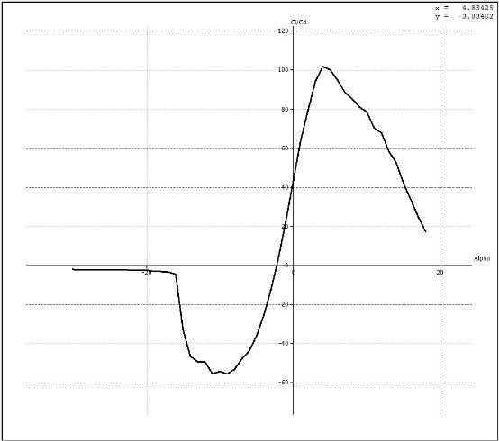
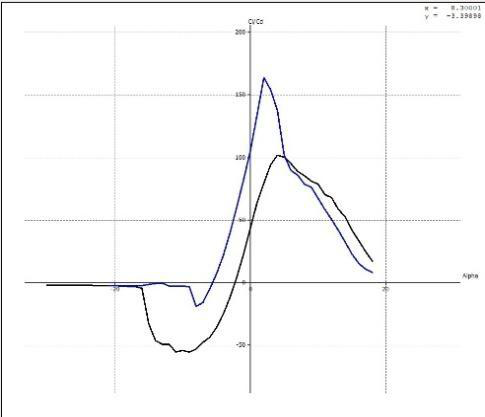

# Results

## XFOIL comparison of all approaches (`xfoil/`)

The final airfoil of every approach tried during the project was analysed with the same XFOIL
settings: Re = 10⁶, M = 0, Ncrit = 9, re-panelled, α = −2° to 18° in 0.5° steps
(`MATLAB/Aerodynamics/compare_approaches.m`). NACA sections use the closed-trailing-edge form of the
thickness formula. A peak value counts only if a neighbouring angle confirms it, so a single spurious
XFOIL point cannot set it.

| Approach | t/c | Peak CL/CD (α) | Peak CL^1.5/CD | CL,max (α) | CM at 0° |
|---|---:|---:|---:|---:|---:|
| **XFOIL GA + fmincon, PARSEC, t ≥ 0.12** (`optimize_xfoil_parsec.m`) | 0.123 | **182.5** (4.5°) | **190.5** | 1.553 (16.5°) | −0.124 |
| Report method: GA + fmincon, camber/thickness (`gian.m`) | 0.080 | 178.9 (2.5°) | 170.6 | 1.524 (13.5°) | −0.156 |
| NSGA-II multi-objective (`idkwimdt.m`) | 0.080 | 175.7 (3.0°) | 174.4 | 1.541 (14.0°) | −0.159 |
| XFOIL GA + fmincon, NACA [m p t], t ≥ 0.08 (`optimize_xfoil_naca.m`) | 0.080 | 171.4 (2.5°) | 165.0 | 1.516 (14.0°) | −0.149 |
| XFOIL GA + fmincon, NACA [m p t], t ≥ 0.12 (`optimize_xfoil_naca.m`) | 0.127 | 153.2 (3.0°) | 150.5 | 1.603 (17.5°) | −0.150 |
| `optimize_airfoil('NACA 2412')`, CST + XFOIL | 0.120 | 145.1 (5.5°) | 149.9 | 1.409 (16.0°) | −0.065 |
| XFOIL GA + fmincon, PARSEC, t ≥ 0.08 \* | 0.081 | 143.9 (2.5°) | 143.1 | 1.741 (15.5°) | −0.184 |
| Bezier camber line, 12 % thick (`letshope.m`, fixed) | 0.120 | 112.2 (4.5°) | 106.1 | 1.483 (16.0°) | −0.056 |
| PARSEC fit of NACA 2412 | 0.120 | 104.9 (6.0°) | 102.1 | 1.404 (15.0°) | −0.046 |
| **NACA 2412 (baseline)** | 0.120 | **104.6** (4.5°) | **95.7** | 1.429 (16.0°) | −0.048 |
| PARSEC GA, minimum area (`GAairfoil.m`, reference method) | 0.101 | 97.1 (3.5°) | 99.6 | 1.705 (15.5°) | −0.115 |
| GA + PSO + fmincon with the sign error (`suniyo.m` / `deki.m`) | 0.130 | 77.3 (9.0°) | 79.2 | 1.313 (16.5°) | 0.000 |
| Thin Bezier "supersonic" target (`trialgp.m`) | 0.050 | 55.4 (1.0°) | 35.5 | 0.610 (5.5°) | −0.009 |

\* Not reliable. The PARSEC t ≥ 0.08 design scored 394.6 inside its optimiser, which used an earlier
XFOIL wrapper, and scores 143.9 here. The NACA t ≥ 0.08 design used to stop converging above α = 0.5°;
with XFOIL restarts it now gives a full polar (171.4), in line with the almost identical report
airfoil (178.9).

What the comparison shows:

- **Putting XFOIL in the loop is what makes the difference.** The geometric objectives (camber/thickness,
  minimum area) either run to the bounds or do not target efficiency at all. The area-minimising PARSEC
  GA ends up below the baseline.
- **Shape freedom matters.** With the thickness held at 12 %, the best NACA 4-digit section (m = 0.050,
  p = 0.52, t = 0.127) reaches 153. PARSEC can also move the thickness peak and shape the rear of the
  section, which adds another 19 % (182.5).
- **The 8 %-thick designs owe their efficiency to being thin.** The report airfoil and the NSGA-II
  and NACA t ≥ 0.08 designs reach 171–179, but with a third less thickness, the largest pitching moments and the earliest
  stall.
- **The sign error explains the "no improvement" runs.** `suniyo.m` and `deki.m` minimised camber
  instead of maximising it and produced symmetric airfoils, 26 % worse than NACA 2412.
- **XFOIL is consistent.** The PARSEC fit of NACA 2412 scores within 0.3 % of NACA 2412 itself (104.9
  against 104.6), and the peak values of the main designs change by less than 1 % between 140 and 240
  panel nodes (next section).

### Robustness of the peak values

Two problems made earlier numbers depend on how XFOIL panelled the airfoil. Both are fixed:

- The standard NACA thickness formula leaves a trailing edge 0.25 % of chord thick, which the
  geometry routine closed with a small, almost vertical step. The step cost NACA 2412 about 2.5 % of
  its peak L/D (102.0 instead of 104.6), and XFOIL broke down on it at 240 panel nodes. NACA sections
  are now generated with the closed-trailing-edge coefficient (−0.1036) for all aerodynamic work.
- The earlier peak filter, a 3-point moving median, compared points across angles that had not
  converged, and in one case cut the PARSEC design's peak of 182.5 down to 157.

Peak CL/CD after both fixes ([panel_check.csv](xfoil/panel_check.csv)):

| Panel nodes | 140 | 160 | 180 | 200 | 220 | 240 |
|---|---:|---:|---:|---:|---:|---:|
| NACA 2412 | 104.4 | 104.6 | 104.7 | 104.9 | 105.1 | 104.9 |
| Report airfoil | 178.9 | 178.9 | 178.6 | 178.6 | 178.7 | 178.7 |
| PARSEC, t ≥ 12 % | 183.1 | 182.5 | 182.7 | 182.8 | 182.4 | 182.5 |
| CST, `optimize_airfoil` | 145.3 | 145.1 | 144.6 | 144.7 | 144.6 | 144.5 |
| NACA [m p t], t ≥ 12 % | 152.9 | 153.0 | 152.9 | 153.0 | 152.8 | 153.0 |

### Recommended design

**PARSEC, XFOIL-optimised, t ≥ 12 %**: [`NACA2412_parsec_t12_optimized.dat`](xfoil/NACA2412_parsec_t12_optimized.dat)

| r_le | x_up | y_up | y_xx,up | x_lo | y_lo | y_xx,lo | y_te | Δy_te | α_te | β_te |
|---:|---:|---:|---:|---:|---:|---:|---:|---:|---:|---:|
| 0.01622 | 0.45933 | 0.10751 | −0.52059 | 0.42516 | −0.01575 | 0.31189 | 0 | 0 | −2.710° | 13.003° |

Compared with NACA 2412: peak L/D +74 %, peak CL^1.5/CD +99 %, CL,max +8.6 % with stall 0.5° later,
same thickness (12.3 %, at 44 % chord instead of 30 %). Two things to consider before using it:

- The pitching moment at α = 0° is −0.124, about 2.6 times that of NACA 2412 (−0.048), so the tail must
  trim a larger nose-down moment.
- The efficiency peak is narrow, about 1° of α. At CL = 0.5 the airfoil is less efficient than NACA
  2412 (63 against 83).

If these matter more than peak efficiency, the CST design from `optimize_airfoil`
([`NACA2412_cst_optimized.dat`](xfoil/NACA2412_cst_optimized.dat)) is the better choice: +39 % peak
L/D and +57 % CL^1.5/CD with a pitching moment of only −0.065, and more efficient than NACA 2412 from
CL ≈ 0.45 to 1.3.

| CL/CD at | CL = 0.3 | CL = 0.5 | CL = 0.8 | CL = 1.0 | CL = 1.2 |
|---|---:|---:|---:|---:|---:|
| NACA 2412 | 55.6 | 83.0 | 104.5 | 90.4 | 78.5 |
| Report airfoil | – | 84.6 | 168.7 | 165.1 | 89.8 |
| PARSEC, t ≥ 12 % | – | 63.1 | 124.5 | 168.9 | 80.5 |
| CST, `optimize_airfoil` | 46.3 | 90.4 | 130.6 | 144.8 | 89.1 |

(– : the airfoil does not reach that low a CL within α ≥ −2°.)

### Morphing to the recommended design

`MATLAB/Morphing/morph_to_design.m` blends NACA 2412 into the PARSEC design in 20 steps. The peak L/D
rises at every step analysed, from 105 to 183.

| | |
|---|---|
|  |  |

### Files

| File | Contents |
|---|---|
| `NACA2412_parsec_t12_optimized.dat` | Recommended airfoil (PARSEC, XFOIL-optimised, t ≥ 12 %) |
| `NACA2412_cst_optimized.dat` | Result of `optimize_airfoil('NACA 2412')` |
| `NACA2412_naca_t12_optimized.dat` | Best NACA 4-digit section with t ≥ 12 % (m = 0.050, p = 0.524, t = 0.127) |
| `polar_*.csv` | α, CL, CD, CM of NACA 2412, the report airfoil and the three designs above |
| `ld_at_cl.csv` | L/D at fixed lift coefficients |
| `panel_check.csv` | Peak L/D of the main designs for 140–240 panel nodes |
| `approach_comparison.csv`, `approach_comparison.png`, `ld_polars.png` | All approaches ranked; L/D against α |
| `designs.png`, `polars.png` | Shapes; lift, L/D against CL and pitching moment |
| `NACA2412_cst_summary.csv`, `NACA2412_cst_comparison.png` | Before/after output of `optimize_airfoil` |
| `morph_to_design.gif`, `morph_efficiency.png`, `morph_efficiency.csv` | Morph to the PARSEC design with the peak L/D of every second step |

All `.dat` files are in Selig format with fewer than 300 points and open in XFLR5.

## `optimize_airfoil` on other airfoils (`optimize_airfoil/`)

Same XFOIL settings and default options: never thinner than the original, and |CM| at 0° may grow by
at most 0.05.

| Airfoil | Peak CL/CD | Peak CL^1.5/CD | CM at 0° | t/c | Run time (8 cores) |
|---|---|---|---|---|---:|
| NACA 0012 | 76.5 → 123.7 (+62 %) | 76.0 → 117.6 (+55 %) | 0.000 → −0.027 | 0.120 → 0.120 | 48 min |
| NACA 2412 | 104.6 → 145.0 (+39 %) | 95.7 → 149.8 (+57 %) | −0.048 → −0.065 | 0.120 → 0.120 | 35 min |
| NACA 4412 | 129.6 → 168.5 (+30 %) | 133.6 → 172.0 (+29 %) | −0.096 → −0.131 | 0.120 → 0.121 | 32 min |
| NACA 23012 | 98.9 → 133.9 (+35 %) | 104.3 → 135.1 (+29 %) | −0.003 → −0.034 | 0.120 → 0.121 | 34 min |
| NACA 2412, no CM limit \*\* | 104.6 → 166.8 (+59 %) | 95.7 → 172.7 (+80 %) | −0.048 → −0.112 | 0.120 → 0.120 | 36 min |

\*\* `optimize_airfoil('NACA 2412', 'CmIncrease', Inf, 'MaxChange', 0.15)`: no limit on the pitching
moment and wider bounds on the shape. This reaches 91 % of the PARSEC design (182.5) with a smaller
nose-down moment (−0.112 against −0.124) and 14 % more CL,max, so the general CST optimiser gets close
to the specialised PARSEC search when it is allowed the same trade-off.

- Each folder holds the optimised `.dat` file, both polars, `summary.csv` and `comparison.png`.
- The gains hold under the optimiser's own score, the lower result of two panellings (NACA 0012:
  76.5 → 123.4, NACA 2412: 104.6 → 144.8, NACA 4412: 129.5 → 168.1, NACA 23012: 98.0 → 133.7).
- CL,max is not constrained, and it changes by −4.7 % (23012) to +2.5 % (0012) in the default runs.
- During the NACA 0012 run the pitching-moment limit was not active, because of a bug that has since
  been fixed; the result is within the limit anyway.
- Baselines are the closed-trailing-edge sections.

## More `optimize_airfoil` runs: other seeds, options and flight phases

All runs use Re = 10⁶ and the default limits: never thinner than the seed, and |CM| at 0° may grow
by at most 0.05. Each folder in `optimize_airfoil/` holds the optimised `.dat` file, both polars,
`summary.csv` and `comparison.png`.

| Run | Setting | Result |
|---|---|---|
| Clark Y (`MATLAB/airfoils/clarky.dat`) | default | peak CL/CD 114.8 → 171.1 (+49 %), CL^1.5/CD 122.6 → 188.2 (+54 %) |
| NACA 2412, particle swarm → pattern search | `'Algorithm', 'pso'` | peak CL/CD 104.6 → 146.9 (+40 %); GA → fmincon gives 145.0 |
| NACA 2412, cruise | `'Objective', 'LDatCL', 'DesignCL', 0.4` | CL/CD at CL = 0.4: 71.3 → 85.6 (+20 %) |
| NACA 2412, loiter | `'Objective', 'endurance'` | CL^1.5/CD 95.0 → 152.3 (+60 %) |
| NACA 2412, cruise and loiter | `'DesignCL', [0.4 1.0], 'Weights', [0.2 0.8]` | weighted CL/CD 85.3 → 129.3 (+52 %) |
| NACA 2412, keep maximum lift | `'KeepCLmax', true` | peak CL/CD 104.6 → 143.3 (+37 %), CL,max 1.43 → 1.51 |

- The two search methods end within 1.5 % of each other. That is within the run-to-run scatter of a
  single run, so they are not ranked here.
- Keeping CL,max costs about 1 % of peak efficiency against the default run (145.0). In return, CL,max
  rises by 5.5 % instead of falling by 1.7 %.

## Benchmark against Xoptfoil2 (`xoptfoil2/`)

[Xoptfoil2](https://github.com/jxjo/Xoptfoil2) 2.0.0 is an established airfoil optimiser: Bezier shape
functions, particle swarm, XFOIL built in. It was given the same task as the weighted run above
(`naca2412_weighted.xo2`): maximum CL/CD at CL = 0.4 (weight 0.2) and CL = 1.0 (weight 0.8), with
t/c ≥ 12 %. Its leading-edge curvature check had to be switched off, because the NACA 2412 seed
already fails it. Both results were re-analysed with the settings used here (lower value of 160 and
200 panel nodes; [benchmark.csv](xoptfoil2/benchmark.csv)):

| | CL/CD at CL = 0.4 | at CL = 1.0 | Weighted | Peak CL/CD | t/c | CM at 0° | Run time |
|---|---:|---:|---:|---:|---:|---:|---:|
| NACA 2412 | 71.5 | 90.2 | 86.4 | 104.6 | 0.120 | −0.048 | |
| `optimize_airfoil` (CST, GA → fmincon) | 72.9 | 143.2 | **129.2** | 143.3 | 0.121 | −0.060 | 38 min |
| Xoptfoil2 (Bezier, particle swarm) | 69.6 | 130.8 | 118.5 | 130.9 | 0.131 | −0.052 | 1.5 min |

`optimize_airfoil` scores 9 % higher but takes 25 times longer. It also has no curvature constraints,
which Xoptfoil2 enforces; the next section shows what that means.

## Curvature check (`curvature_check.csv`)

`MATLAB/Aerodynamics/check_curvature.m` fits every airfoil with a smooth high-order CST shape. It then
counts curvature reversals between 10 % and 97 % chord on each surface, and records the largest
curvature over the last 5 % of chord. Xoptfoil2 limits both, because optimisers learn to exploit
XFOIL's sensitivity to small shape details (for example a tiny "spoiler" at the trailing edge).

- The seeds are clean: NACA 2412 has no reversals and a trailing-edge curvature of 1.39 (upper
  surface).
- Most `optimize_airfoil` designs have 1–2 reversals per surface, i.e. slightly wavy surfaces.
- The recommended PARSEC design has 1 reversal on the upper surface, 4 on the lower one, and a
  trailing-edge curvature of 3.05.
- Xoptfoil2's design has 0 and 1 reversals and a trailing-edge curvature of 0.34.

Part of the advantage of our designs may therefore come from shape details that XFOIL rewards more
than a real flow would. Two follow-ups are planned: curvature constraints in `optimize_airfoil`, and
checking the designs with CFD (`MATLAB/CFD`, in progress).

## Morphing (`morphing/`)

**Morphing envelope** (`morph_envelope.m`): the cruise and loiter designs above are blended in 10 steps.
At each lift coefficient, a morphing wing can use the best intermediate shape. Every shape was
analysed with 160 and 200 panel nodes, and the lower CL/CD is used.

| CL/CD at | CL = 0.4 | CL = 0.8 | CL = 1.0 | CL = 1.2 |
|---|---:|---:|---:|---:|
| NACA 2412 | 71.5 | 104.3 | 90.3 | 78.6 |
| cruise design (fixed) | **85.6** | 113.0 | 80.6 | 67.6 |
| loiter design (fixed) | 60.2 | 118.3 | 134.4 | **138.4** |
| weighted compromise (fixed) | 72.9 | **128.7** | **143.1** | 76.3 |
| morphing between cruise and loiter | **85.6** | 120.2 | 134.4 | **138.4** |

- Morphing beats every fixed airfoil at low lift (cruise) and at high lift.
- Between CL ≈ 0.75 and 1.05, the fixed compromise design is better than any shape on the path
  between the two end designs. Which end shapes are chosen matters as much as the ability to morph.

**Nose and trailing-edge morphing with a fixed wing box** (`optimize_le_te_morphing.m`): only 0–15 %
and 65–100 % of the chord of NACA 2412 are deflected, and the box in between is kept.

| Flight phase | Nose deflection | Trailing-edge deflection | NACA 2412 | Morphed |
|---|---:|---:|---:|---:|
| Cruise (CL/CD at CL = 0.4) | 0 | 0.02 c down | 71.5 | 74.8 (+4.6 %) |
| Loiter (max CL^1.5/CD) | 0 | 0.06 c down | 95.6 | 175.7 (+84 %) |
| High lift (CL,max) | 0.05 c down | 0.06 c down | 1.43 | 2.06 (+44 %) |

- The loiter and high-lift optima sit at the largest deflections in the grid, so larger deflections
  could do even better.
- XFOIL tends to over-predict CL,max.
- A first version of this study showed a loiter gain of +403 %. That came from a spurious, almost
  fully laminar XFOIL solution at one panelling; the two-panelling check removed it.

## Airfoils analysed in XFLR5 for the report

`morph_sequence/` holds the 21 files (steps 00–20) produced by the project run and analysed for the
report. Step 00 is the NACA 2412 baseline and step 20 is the optimised airfoil; the same two files
are in `airfoils/` with descriptive names.

| | m | p | t | camber/thickness |
|---|---:|---:|---:|---:|
| NACA 2412 (baseline) | 0.020 | 0.400 | 0.120 | 0.167 |
| Optimised | 0.050 | 0.516 | 0.080 | 0.627 |

The optimised parameters were recovered from the step-20 file by fitting the NACA equations to its
coordinates (rms error 4×10⁻⁷, i.e. rounding level). `MATLAB/NACA2412/naca4.m` reproduces the baseline
file byte for byte.

## Why the report's optimum sits on the bounds

The objective (camber/thickness) keeps increasing with camber and decreasing with thickness, so the
maximum is always the corner `m = 0.05`, `t = 0.08`. The GA + fmincon run was repeated with five random
seeds ([ga_nlp_seeds.csv](ga_nlp_seeds.csv)). Every run gives m = 0.050, t = 0.080 and camber/thickness
= 0.627, while `p` ends anywhere between 0.48 and 0.60 because it hardly affects the objective.

## XFLR5 results (from the project report)

| | NACA 2412 | Optimised | Change |
|---|---:|---:|---:|
| CL at α = 0° | 0.24713 | 0.59103 | +139.2 % |
| CD at α = 0° | 0.00572 | 0.00564 | −1.4 % |
| CL/CD at α = 0° | 43.20 | 104.79 | +142.6 % |
| CL at stall | 1.54895 (α = 16°) | 1.53146 (α = 13.3°) | −1.1 % |
| CL/CD at stall | 33.45 (α = 16°) | 38.96 (α = 13.3°) | different α, not comparable |

Notes on reading these numbers:

- **The α = 0° values are not the peak values.** The report's CL/CD polars show the baseline peaking at
  about 100 near α ≈ 4–5° and the optimised airfoil at about 160 near α ≈ 2°, roughly +55–60 % peak to
  peak (XFOIL: 104.6 → 178.9, +71 %). The +142.6 % applies only at α = 0°, where the extra camber
  raises the lift on its own.
- Above α ≈ 6° the baseline has the higher CL/CD, and the optimised airfoil stalls about 2.7° earlier
  with a slightly lower CL,max.
- The XFLR5 settings (Reynolds number, Mach number, Ncrit, panelling) were not recorded. The drag
  values suggest Re ≈ 10⁶. XFOIL at Re = 10⁶ gives similar drag and peak L/D for NACA 2412, but
  about 0.02 less lift at 0° and a lower CL,max (1.43).
- The report did not evaluate the pitching moment. XFOIL gives CM = −0.156 at α = 0° for the optimised
  airfoil against −0.048 for NACA 2412.

| Baseline CL/CD vs α (report Fig. 4.4) | Optimised (blue) vs baseline (black) (report Fig. 4.8) |
|---|---|
|  |  |

The polar curves are noisy at negative angles of attack (XFOIL convergence); only the positive-α
part is used above.
