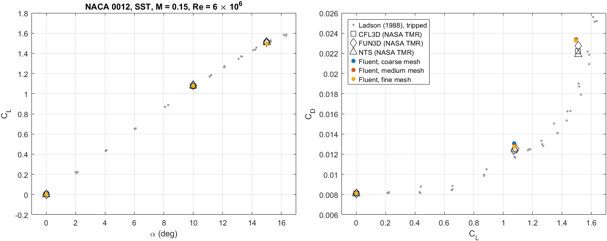
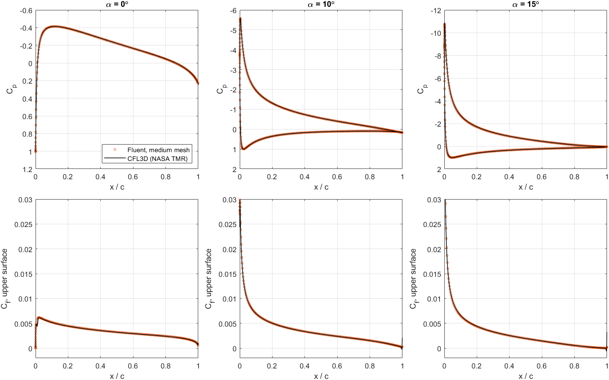
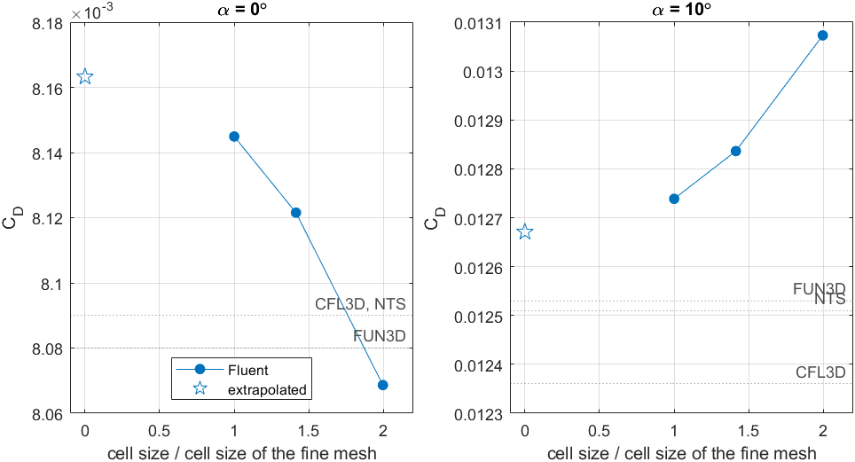
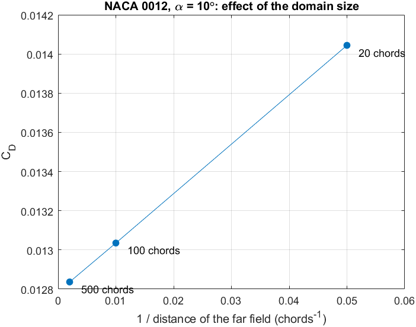
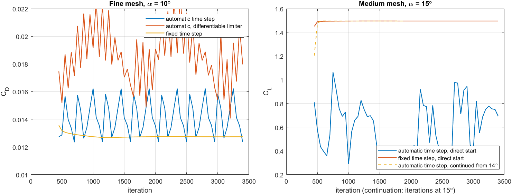
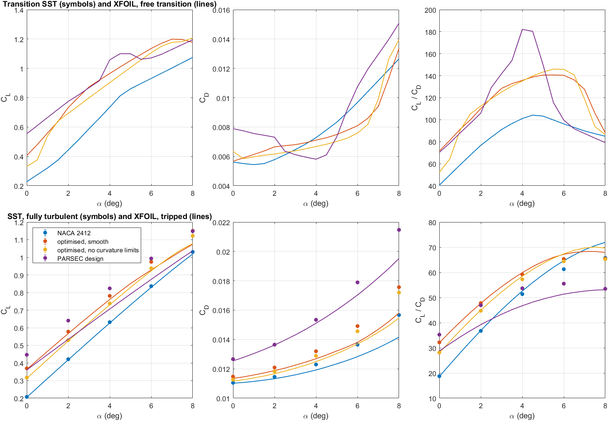

# CFD results (ANSYS Fluent)

The RANS runs check the XFOIL results with an independent method. This folder has three parts:

| Folder | Contents | State |
|---|---|---|
| [timestep_study](timestep_study) | which solver settings give a steady solution | done |
| [verification](verification) | the set-up against NASA's NACA 0012 case | done |
| [designs](designs) | the NACA 2412 designs with Transition SST and SST | XFOIL side done; SST done for four of the six airfoils; Transition SST in progress |

All files are written by `MATLAB/CFD/collect_cfd_results.m` from the outputs of `timestep_study.m`,
`verify_naca0012.m` and `run_design_study.m`. The Fluent transcripts are not published, because they
contain local paths.

## Verification on NASA's NACA 0012 case

**Case.** 2D NACA 0012 validation case of the NASA Turbulence Modeling Resource: k-ω SST, M = 0.15,
Re = 6 × 10⁶, free-stream turbulence 0.052 % with viscosity ratio 0.009. NASA lists results of three
codes (CFL3D, FUN3D, NTS) on one 897 × 257 grid and notes that they agree within 1 % in lift and 5 % in
drag, and that the results are "representative, but not truth".

**Our runs.** Three geometrically similar meshes (refinement ratio √2) with the far field 500 chords
away: 50,292, 100,240 and 200,376 cells. Fixed pseudo-time step of one chord passage, 400 first-order and
3000 second-order iterations. All runs below are steady: over the last 500 iterations CL varies by less
than 0.0001 and CD by less than 0.00001.

| α | | Coarse | Medium | Fine | CFL3D | FUN3D | NTS |
|---|---|---:|---:|---:|---:|---:|---:|
| 0° | CD | 0.00807 | 0.00812 | 0.00814 | 0.00809 | 0.00808 | 0.00809 |
| 10° | CL | 1.0747 | 1.0757 | 1.0749 | 1.0778 | 1.0840 | 1.0765 |
| 10° | CD | 0.01307 | 0.01284 | 0.01274 | 0.01236 | 0.01253 | 0.01251 |
| 15° | CL | not steady | 1.4955 | 1.4925 | 1.5068 | 1.5109 | 1.5100 |
| 15° | CD | not steady | 0.02339 | 0.02326 | 0.02219 | 0.02275 | 0.02187 |

- **Lift** on the fine mesh is 0.1 to 0.8 % below the three codes at 10° and 0.9 to 1.2 % below them at 15°.
- **Drag** on the fine mesh is 0.7 to 0.8 % above them at 0°, 1.7 to 3.1 % above at 10° and 2.3 to 6.4 %
  above at 15°. The three codes themselves differ by up to 4 % at 15°.
- **The medium mesh**, whose resolution the design study uses, is 2.4 to 3.9 % above the three codes in
  drag at 10°.
- **On the coarse mesh the 15° case does not reach a steady state**; it falls onto a stalled solution.

**Pressure and skin friction** ([surface_comparison.csv](verification/surface_comparison.csv)). On the
medium mesh the skin friction on the upper surface differs from CFL3D's by 0.6 %, 0.4 % and 0.7 % of its
mean value at 0°, 10° and 15° (between 5 % and 95 % chord). The suction peak at 10° is −5.576 against
−5.604.

**Mesh convergence** ([grid_convergence.csv](verification/grid_convergence.csv); procedure of Celik et
al. 2008).

| α | Quantity | Apparent order | Extrapolated | Uncertainty, fine mesh | Uncertainty, medium mesh |
|---|---|---:|---:|---:|---:|
| 0° | CD | 2.4 | 0.00816 | 0.28 % | 0.64 % |
| 10° | CD | 2.6 | 0.01267 | 0.67 % | 1.61 % |

The lift at 10° changes by less than 0.1 % between the meshes and not monotonically, so no order is
given for it. At 15° only two meshes give a steady solution; the medium mesh is 0.6 % above the fine one
in drag.

**Domain size** ([farfield.csv](verification/farfield.csv)). With the resolution of the medium mesh at
10°, a far field 20 chords away raises the drag by 9.4 % and lowers the lift by 0.5 %; at 100 chords
the drag is still 1.5 % too high. The error falls roughly in proportion to the distance, which leaves
about 0.3 % at 500 chords. It grows with lift, so a small domain would penalise exactly the designs that
carry more lift.

## Which solver settings give a steady solution

Fluent's pressure-based coupled solver advances in pseudo-time. Its automatic time step is tied to the
size of the domain, so it is very large for a 500-chord domain. `timestep_study.m` compares it with a
fixed step of one chord passage ([forces.csv](timestep_study/forces.csv)).

| Case | Automatic step | Fixed step (one chord passage) |
|---|---|---|
| 10°, coarse mesh | CD 0.01307, steady | CD 0.01307, steady |
| 10°, medium mesh | CD 0.01284, steady | CD 0.01284, steady |
| 10°, fine mesh | not steady: CD varies by 0.0039 over the last 500 iterations | CD 0.01274, steady |
| 15°, medium mesh, started directly | stalled: CL 0.69, CD 0.28 | CL 1.4955, CD 0.02339, steady |
| 15°, medium mesh, reached from 10° in steps | CL 1.4954, CD 0.02339, steady | not settled after 1500 iterations per angle |

- **Where both settings converge, they give the same forces.**
- **The differentiable slope limiter does not help:** the fine mesh with the automatic step stays unsteady.
- **Mach 0.1 converges with the fixed step** (CD 0.00812 at 0°). With the automatic step it had diverged.

## Design study

Six airfoils at Re = 10⁶ and M = 0.15 (`MATLAB/CFD/designStudyAirfoils.m`): NACA 2412; three designs
optimised for the peak CL/CD with free transition (the smooth and the wavy design of `results/paper` and
the earlier PARSEC design); and two designs optimised for free and tripped flow together
(`results/population`).

**XFOIL at the same condition** ([designs/xfoil.csv](designs/xfoil.csv)), best CL/CD between −2° and 12°:

| Airfoil | Free transition, Ncrit 9 | Tripped at 5 % chord |
|---|---:|---:|
| NACA 2412 | 104.2 | 72.6 |
| optimised, smooth | 140.7 | 68.3 |
| optimised, no curvature limits | 146.0 | 70.1 |
| PARSEC design | 182.1 | 53.2 |
| optimised for free and tripped flow (mean) | 138.1 | 74.5 |
| optimised for the worse of free and tripped | 103.4 | 77.4 |

- **With tripped boundary layers the three designs optimised for free transition alone are worse than
  the original.** Their gain comes from laminar flow.
- **The two designs that had the tripped condition in their objective are not.** The first keeps almost
  the whole free-transition gain; the second gives it up for the best tripped value.
- **The Mach number matters little:** at M = 0 the free-transition values of the first four are 104.6,
  141.6, 145.9 and 182.5.

**Fluent, start-up check.** The first run repeats the NASA case with the start-up of the design study and
gives the same forces as the
verification (CL 1.0757, CD 0.01284).

### Fully turbulent flow (SST)

Done for the first four airfoils at 0° to 8° (20 runs, all steady); the two other airfoils and 10° are
queued. CL/CD from Fluent, and in brackets from XFOIL with the boundary layers tripped at 5 % chord
([designs/comparison.csv](designs/comparison.csv)):

| Airfoil | 0° | 2° | 4° | 6° | 8° |
|---|---:|---:|---:|---:|---:|
| NACA 2412 | 18.8 (18.6) | 36.8 (36.9) | 51.4 (52.6) | 61.3 (64.7) | 65.8 (72.0) |
| optimised, smooth | 32.2 (32.0) | 47.8 (47.7) | 59.2 (59.9) | 65.3 (67.2) | 65.5 (68.0) |
| optimised, no curvature limits | 28.1 (28.0) | 44.8 (45.0) | 57.3 (58.5) | 64.4 (67.4) | 65.3 (69.7) |
| PARSEC design | 35.2 (28.7) | 46.9 (39.2) | 53.7 (46.7) | 55.5 (51.4) | 53.5 (53.1) |

- **Without laminar flow the optimised designs have no advantage.** The best CL/CD over these angles is
  65.8 for NACA 2412, 65.5 and 65.3 for the two CST designs (0.4 % and 0.8 % lower) and 55.5 for the
  PARSEC design (15.6 % lower) ([designs/peaks.csv](designs/peaks.csv)). XFOIL with tripped boundary
  layers puts the three designs 5.6 %, 3.2 % and 26.2 % below the original at the same angles. Both
  methods put the original first and the PARSEC design far behind; Fluent sees a smaller loss for the
  CST designs.
- **At a fixed small angle the designs look better even here.** At 4° they reach 53.7 to 59.2 against
  51.4, because they carry more lift at the same angle. At the best angle the difference is gone.
- **Fluent and tripped XFOIL agree closely at low lift.** For NACA 2412 and the two CST designs
  Fluent's lift is 0.7 to 7.1 % higher than XFOIL's, and its drag is higher by 0.2 to 1.1 % at 0° and by
  10.7 to 11.1 % at 8°. For the PARSEC design Fluent's lift is 10.8 to 23.9 % higher than XFOIL's.
- **The peak is not reached at 8°** for the original, whose CL/CD still rises there; this is why the
  runs at 10° were added.
- **Mesh.** NACA 2412 at 4° on the refined mesh (200,376 cells) gives a drag that differs by 0.03 % from
  the mesh of the design study ([designs/mesh_check.csv](designs/mesh_check.csv)).

### Transition SST

The runs are in progress. They do not settle; `MATLAB/CFD/README.md` describes why and how the forces
are averaged.
