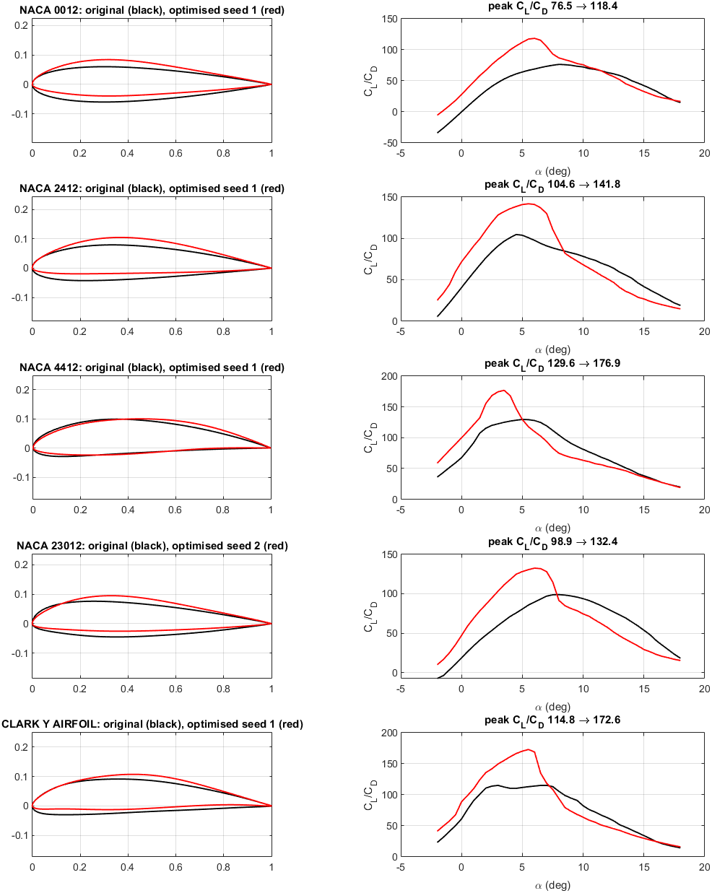
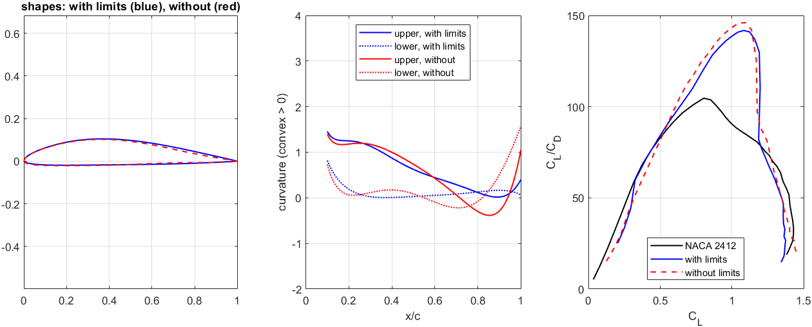
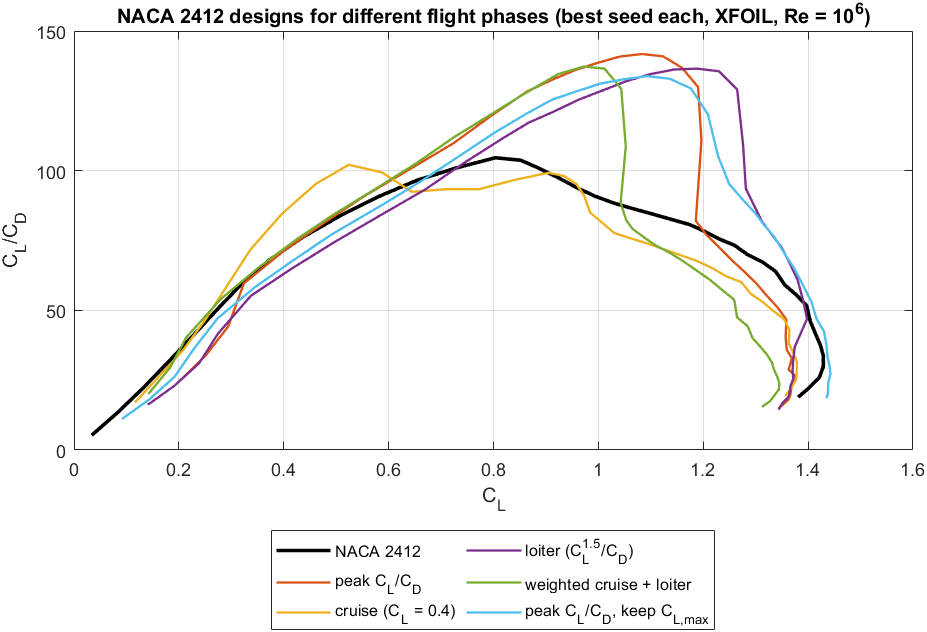
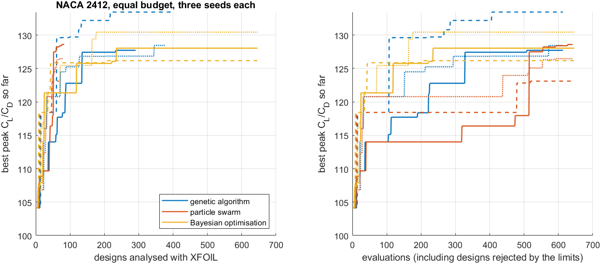
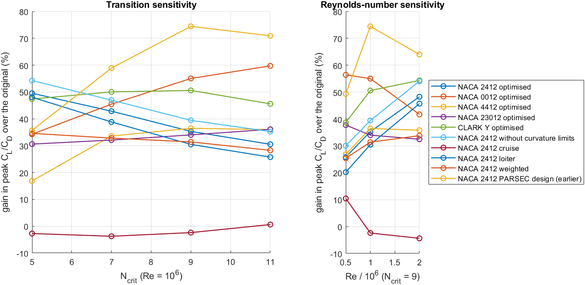
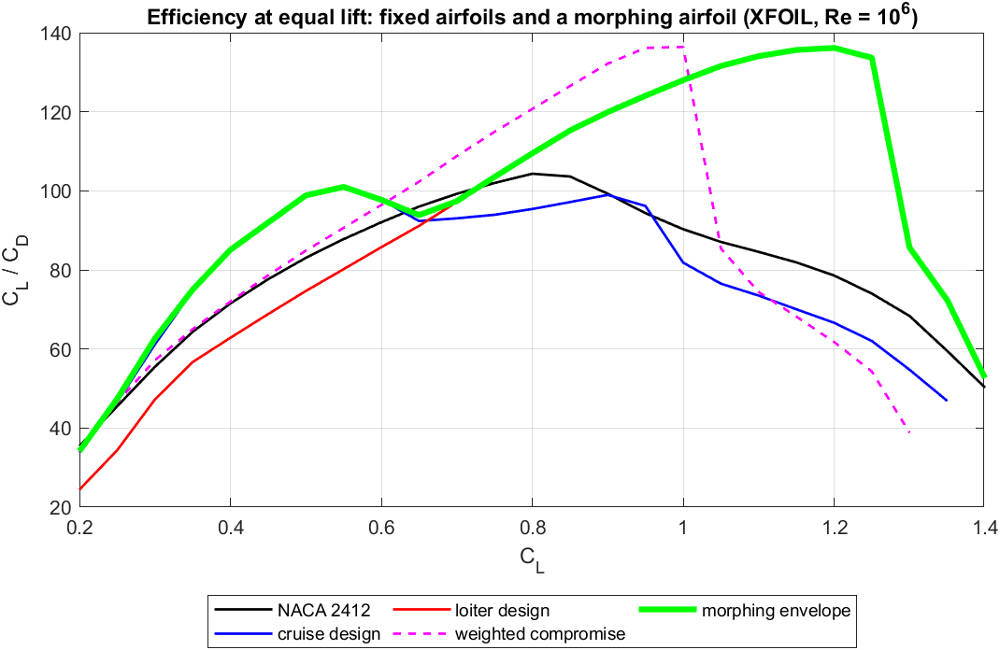

# Paper results: smooth shapes, three random seeds

These results come from 37 runs of `optimize_airfoil` defined in
[MATLAB/Paper/run_paper_batch.m](../../MATLAB/Paper/run_paper_batch.m) and were collected by
[collect_paper_results.m](../../MATLAB/Paper/collect_paper_results.m). All numbers in this file are generated
from the CSV files in this folder. Every run used XFOIL at Re = 10⁶, Ncrit = 9, and, unless stated, the
default limits: thickness kept, |CM at 0°| may grow by at most 0.05, and the curvature limits (no more
curvature reversals and no larger trailing-edge curvature than the original). Each case was run with
three random seeds. Per-run files are in [runs/](runs); [runs.csv](runs.csv) lists every run and
[cases.csv](cases.csv) the statistics over the seeds.

**Checks.**
- All 37 runs ran at normal machine speed: the median time per analysed design was 4.5–11.5 s with
  6 parallel workers. An earlier attempt, in which Windows slowed the laptop down with the screen off,
  was discarded.
- 34 of the 34 runs with curvature limits produced designs that meet them.
- Share of XFOIL-analysed designs rejected afterwards: at most 17 % per run, but up to 83 % within
  30 consecutive analyses (NACA_2412_keepclmax_s1, NACA_2412_nocurv_s2, NACA_2412_nocurv_s3). These runs push into shapes that XFOIL cannot analyse (no curvature
  limits) or that break the maximum-lift limit; their speed was normal, so they were not disturbed.
- The first three runs were made twice, before and after a change to the XFOIL time limit, and gave
  identical results.

## Optimised airfoils (peak CL/CD)

| Airfoil | Original | Seeds 1 / 2 / 3 | Mean ± std | Mean gain | CL,max original → mean | CM at 0° original → mean |
|---|---:|---:|---:|---:|---:|---:|
| NACA 0012 | 76.5 | 118.4 / 111.1 / 118.9 | 116.1 ± 4.4 | +52 % | 1.31 → 1.37 | 0.000 → −0.021 |
| NACA 2412 | 104.6 | 141.8 / 137.7 / 138.6 | 139.4 ± 2.1 | +33 % | 1.43 → 1.36 | −0.048 → −0.056 |
| NACA 4412 | 129.6 | 176.9 / 158.6 / 167.7 | 167.7 ± 9.1 | +29 % | 1.53 → 1.49 | −0.096 → −0.132 |
| NACA 23012 | 98.9 | 131.3 / 132.4 / 127.7 | 130.5 ± 2.5 | +32 % | 1.46 → 1.39 | −0.003 → −0.034 |
| Clark Y | 114.8 | 172.6 / 170.3 / 172.3 | 171.7 ± 1.2 | +50 % | 1.52 → 1.60 | −0.083 → −0.116 |

Peak CL/CD from the final analysis of each design (α = −2° to 18°). The objective of the search itself,
the lower value of two panellings, is listed in runs.csv.

## Effect of the curvature limits (NACA 2412)

| | Peak CL/CD, seeds 1 / 2 / 3 | Mean ± std | Reversals upper/lower | Trailing-edge curvature upper/lower | CL,max (mean) |
|---|---:|---:|---:|---:|---:|
| with curvature limits | 141.8 / 137.7 / 138.6 | 139.4 ± 2.1 | 0/0, 0/0, 0/0 | 0.40/0.06, 0.35/0.08, 0.23/0.05 | 1.36 |
| without curvature limits | 146.1 / 145.6 / 142.8 | 144.8 ± 1.8 | 2/2, 2/2, 2/4 | 1.06/1.57, 1.78/0.77, 0.28/1.75 | 1.45 |

The limits of the original NACA 2412 fit: 0 reversals on each surface, trailing-edge curvature up to 0.5
(upper) and 0.1 (lower), each with a tolerance of 0.05. On average the smooth designs reach 3.8 % less peak
CL/CD than the unconstrained ones.

## Designs for different flight phases (NACA 2412)

| Case | Objective | Original | Seeds 1 / 2 / 3 | Mean gain | Peak CL/CD (mean) | CL,max (mean) |
|---|---|---:|---:|---:|---:|---:|
| peak CL/CD | peak CL/CD | 104.1 | 141.3 / 137.7 / 138.4 | +34 % | 139.4 | 1.36 |
| cruise | CL/CD at CL = 0.4 | 71.3 | 82.7 / 85.1 / 84.9 | +18 % | 100.8 | 1.34 |
| loiter | peak CL^1.5/CD | 95.0 | 150.4 / 139.6 / 146.2 | +53 % | 132.1 | 1.42 |
| cruise + loiter | 0.2 × CL/CD at 0.4 + 0.8 × at 1.0 | 85.3 | 122.0 / 120.2 / 123.6 | +43 % | 135.6 | 1.40 |
| keep maximum lift | peak CL/CD, CL,max kept | 104.1 | 133.8 | +28 % | 133.8 | 1.44 |

"Original" is the objective of the CST fit of NACA 2412, the starting point of the search.

## Optimiser comparison at equal budget (NACA 2412, peak CL/CD)

Global search only, 40 × 16 = 640 evaluations each (evaluations of designs that break the geometric
limits are counted but need no XFOIL analysis).

| Search | Best objective, seeds 1 / 2 / 3 | Mean ± std | Designs analysed with XFOIL (mean) | Run time (mean) |
|---|---:|---:|---:|---:|
| genetic algorithm | 127.71 / 133.43 / 128.44 | 129.86 ± 3.11 | 359 | 11 min |
| particle swarm | 128.58 / 123.10 / 126.46 | 126.05 ± 2.76 | 79 | 4 min |
| Bayesian optimisation | 128.03 / 126.16 / 130.43 | 128.20 ± 2.14 | 648 | 92 min |
| for reference: GA (50 × 25) → fmincon | 141.34 / 137.73 / 138.36 | 139.14 ± 1.93 | 871 | 28 min |

## Benchmark against Xoptfoil2

Same task as the "cruise + loiter" case: CL/CD at CL = 0.4 (weight 0.2) and 1.0 (weight 0.8), t/c ≥ 12 %.
Xoptfoil2 2.0.0 ran three times with [naca2412_weighted.xo2](../xoptfoil2/naca2412_weighted.xo2) and the
seed [NACA2412.dat](../xoptfoil2/NACA2412.dat). Every design was then analysed with the same protocol
([benchmark_xoptfoil2.m](../../MATLAB/Paper/benchmark_xoptfoil2.m): XFOIL, α = −2° to 18°, lower value
of 160 and 200 panel nodes). Curvature reversals are counted on a 12th-order CST fit with thresholds
0.01 and 0.1. These counts are only indicative: the fit itself adds small waves, so it reports a
reversal on the lower surface of NACA 2412, whose exact lower surface is convex everywhere. The
optimize_airfoil designs are CST shapes of lower order, which the fit reproduces exactly.

| Design | Weighted objective | CL/CD at CL 0.4 | at CL 1.0 | Peak CL/CD | t/c | CM at 0° | Reversals upper/lower (0.01; 0.1) | Run time |
|---|---:|---:|---:|---:|---:|---:|---:|---:|
| NACA 2412 | 86.4 | 71.5 | 90.2 | 104.6 | 0.120 | −0.048 | 0/1; 0/1 | – |
| Xoptfoil2 run 1 | 121.1 | 69.1 | 134.0 | 134.2 | 0.138 | −0.074 | 1/2; 1/0 | 1.9 min |
| Xoptfoil2 run 2 | 119.9 | 70.7 | 132.1 | 132.8 | 0.128 | −0.066 | 1/2; 1/0 | 1.2 min |
| Xoptfoil2 run 3 | 125.6 | 72.8 | 138.8 | 139.7 | 0.138 | −0.083 | 1/1; 1/1 | 1.1 min |
| optimize_airfoil seed 1 | 122.0 | 67.1 | 135.7 | 135.7 | 0.123 | −0.048 | 0/0; 0/0 | 36.1 min |
| optimize_airfoil seed 2 | 120.1 | 68.6 | 132.9 | 133.9 | 0.128 | −0.059 | 0/0; 0/0 | 29.6 min |
| optimize_airfoil seed 3 | 123.6 | 71.9 | 136.4 | 136.9 | 0.124 | −0.069 | 0/0; 0/0 | 31.3 min |

## Sensitivity to transition and Reynolds number

Gain of each design over its original at the same condition, in the quantity the design was optimised
for (XFOIL, 160 panel nodes). The designs were optimised for Re = 10⁶, Ncrit = 9. The figure shows the
gain in peak CL/CD for all designs.

| Design | Quantity | Ncrit 5 | Ncrit 7 | Ncrit 9 | Ncrit 11 | Re 0.5 M | Re 2.0 M |
|---|---|---:|---:|---:|---:|---:|---:|
| NACA 2412 optimised | peak CL/CD | +50 % | +43 % | +35 % | +30 % | +26 % | +48 % |
| NACA 0012 optimised | peak CL/CD | +34 % | +45 % | +55 % | +60 % | +56 % | +42 % |
| NACA 4412 optimised | peak CL/CD | +17 % | +34 % | +36 % | +36 % | +27 % | +36 % |
| NACA 23012 optimised | peak CL/CD | +31 % | +32 % | +34 % | +36 % | +38 % | +32 % |
| CLARK Y optimised | peak CL/CD | +47 % | +50 % | +51 % | +46 % | +39 % | +54 % |
| NACA 2412 without curvature limits | peak CL/CD | +54 % | +47 % | +39 % | +35 % | +30 % | +54 % |
| NACA 2412 cruise | CL/CD at CL 0.4 | +2 % | +20 % | +19 % | +13 % | −2 % | +20 % |
| NACA 2412 loiter | peak CL^1.5/CD | +59 % | +63 % | +57 % | +53 % | +48 % | +64 % |
| NACA 2412 weighted | 0.2 × CL/CD at 0.4 + 0.8 × at 1.0 | +1 % | +38 % | +43 % | +42 % | +38 % | +1 % |
| NACA 2412 PARSEC design (earlier) | peak CL/CD | +36 % | +59 % | +74 % | +71 % | +49 % | +64 % |

## Morphing between the smooth cruise and loiter designs

[morph_envelope.m](../../MATLAB/Morphing/morph_envelope.m) with the best cruise, loiter and weighted designs
(lower CL/CD of 160 and 200 panel nodes at each lift coefficient).

| CL/CD at | CL = 0.4 | CL = 0.6 | CL = 0.8 | CL = 1.0 | CL = 1.2 |
|---|---:|---:|---:|---:|---:|
| NACA 2412 | 71.5 | 92.0 | 104.3 | 90.3 | 78.6 |
| cruise design | 85.1 | 97.7 | 95.4 | 81.8 | 66.6 |
| loiter design | 62.8 | 85.7 | 109.5 | 128.0 | 136.2 |
| weighted design (fixed) | 72.0 | 96.4 | 120.7 | 136.4 | 61.8 |
| morphing envelope | 85.1 | 97.7 | 109.5 | 128.0 | 136.2 |

## Checks per run

| Run | Final objective | Meets curvature limits | Median s per design | Rejected after XFOIL | Worst 30 | Git commit |
|---|---:|---|---:|---:|---:|---|
| NACA_2412_s1 | 141.34 | yes | 8.8 | 0.0 % | 0 % | 000f7c9 |
| NACA_2412_s2 | 137.73 | yes | 8.2 | 0.0 % | 0 % | 000f7c9 |
| NACA_2412_s3 | 138.36 | yes | 8.6 | 0.0 % | 0 % | 000f7c9 |
| NACA_2412_nocurv_s1 | 145.95 | no | 10.1 | 6.3 % | 27 % | 000f7c9 |
| NACA_2412_nocurv_s2 | 145.30 | no | 11.5 | 17.3 % | 57 % | 000f7c9 |
| NACA_2412_nocurv_s3 | 142.62 | no | 9.3 | 9.3 % | 67 % | 000f7c9 |
| NACA_2412_weighted_s1 | 122.05 | yes | 8.2 | 0.1 % | 3 % | 000f7c9 |
| NACA_2412_weighted_s2 | 120.17 | yes | 8.2 | 0.3 % | 7 % | 000f7c9 |
| NACA_2412_weighted_s3 | 123.63 | yes | 7.6 | 0.1 % | 3 % | 000f7c9 |
| cmp_ga_s1 | 127.71 | yes | 8.6 | 0.0 % | 0 % | 000f7c9 |
| cmp_ga_s2 | 133.43 | yes | 7.2 | 0.0 % | 0 % | 000f7c9 |
| cmp_ga_s3 | 128.44 | yes | 10.6 | 0.0 % | 0 % | 000f7c9 |
| cmp_pso_s1 | 128.58 | yes | 6.7 | 0.0 % | 0 % | 000f7c9 |
| cmp_pso_s2 | 123.10 | yes | 4.7 | 0.0 % | 0 % | 000f7c9 |
| cmp_pso_s3 | 126.46 | yes | 6.3 | 0.0 % | 0 % | 000f7c9 |
| cmp_bayesopt_s1 | 128.03 | yes | 4.5 | 0.0 % | 0 % | 000f7c9 |
| cmp_bayesopt_s2 | 126.16 | yes | 5.0 | 0.0 % | 0 % | 000f7c9 |
| cmp_bayesopt_s3 | 130.43 | yes | 5.1 | 0.0 % | 0 % | 000f7c9 |
| NACA_0012_s1 | 118.40 | yes | 8.9 | 0.1 % | 3 % | 000f7c9 |
| NACA_0012_s2 | 111.10 | yes | 9.0 | 0.0 % | 0 % | 000f7c9 |
| NACA_0012_s3 | 118.39 | yes | 8.2 | 0.0 % | 0 % | 000f7c9 |
| NACA_4412_s1 | 176.85 | yes | 8.4 | 0.3 % | 3 % | 000f7c9 |
| NACA_4412_s2 | 158.36 | yes | 8.1 | 0.9 % | 10 % | 000f7c9 |
| NACA_4412_s3 | 167.72 | yes | 7.1 | 1.1 % | 10 % | 000f7c9 |
| NACA_23012_s1 | 131.18 | yes | 10.0 | 1.2 % | 10 % | 000f7c9 |
| NACA_23012_s2 | 131.95 | yes | 8.9 | 0.0 % | 0 % | 000f7c9 |
| NACA_23012_s3 | 127.58 | yes | 7.2 | 0.1 % | 3 % | 000f7c9 |
| CLARK_Y_s1 | 172.59 | yes | 8.0 | 0.0 % | 0 % | 000f7c9 |
| CLARK_Y_s2 | 170.31 | yes | 9.0 | 0.2 % | 7 % | 000f7c9 |
| CLARK_Y_s3 | 171.78 | yes | 7.7 | 0.2 % | 7 % | 000f7c9 |
| NACA_2412_cruise_s1 | 82.69 | yes | 7.7 | 0.0 % | 0 % | 000f7c9 |
| NACA_2412_cruise_s2 | 85.07 | yes | 7.4 | 0.0 % | 0 % | 000f7c9 |
| NACA_2412_cruise_s3 | 84.89 | yes | 9.0 | 0.0 % | 0 % | 000f7c9 |
| NACA_2412_loiter_s1 | 150.36 | yes | 9.4 | 0.4 % | 3 % | 000f7c9 |
| NACA_2412_loiter_s2 | 139.56 | yes | 8.4 | 0.0 % | 0 % | 000f7c9 |
| NACA_2412_loiter_s3 | 146.17 | yes | 8.7 | 0.2 % | 7 % | 000f7c9 |
| NACA_2412_keepclmax_s1 | 133.77 | yes | 10.8 | 12.4 % | 83 % | 000f7c9 |

"Rejected after XFOIL" counts analysed designs that scored no value: XFOIL did not converge over the
required angles, the pitching-moment or maximum-lift limit was broken, or (for CL/CD at a design CL) the
polar did not reach that lift coefficient.
