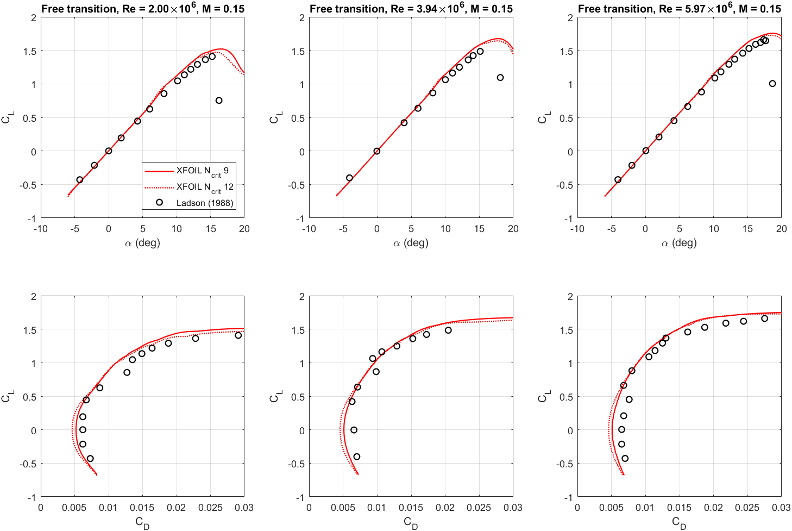
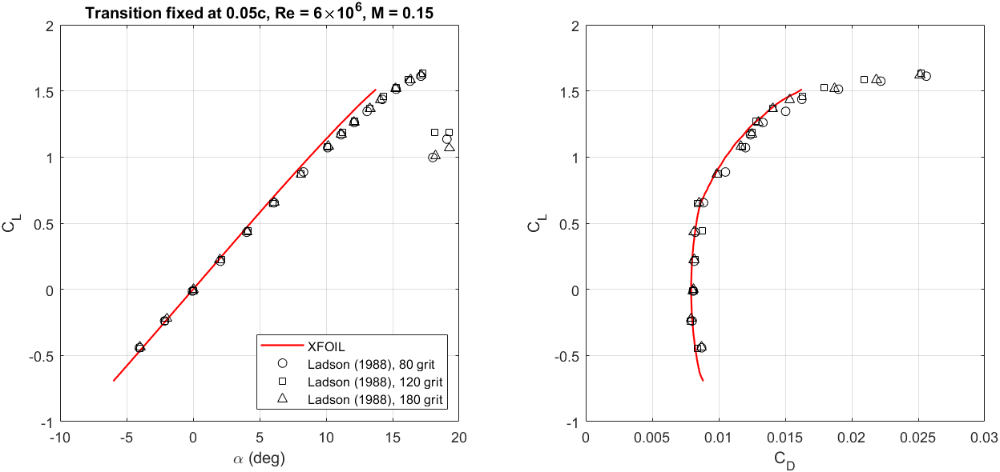

# Validation of the XFOIL analysis against wind-tunnel data (NACA 0012)

The aerodynamic results in this repository come from XFOIL. This folder shows how close the XFOIL analysis, as
used here (`xfoilPolar`: XFOIL 6.99, re-panelled with `PANE`, 160 panel nodes, Ncrit = 9), comes to
wind-tunnel measurements. The script is [MATLAB/Validation/validate_xfoil.m](../../MATLAB/Validation/validate_xfoil.m)
(method in its [README](../../MATLAB/Validation/README.md)); the data and their sources are in
[experimental/](experimental/README.md). The tables below are generated from
[xfoil/summary.csv](xfoil/summary.csv).

Two geometries are analysed: the standard NACA 0012 ordinates, whose trailing edge is 0.25 % of the
chord thick ("blunt"), and the closed-trailing-edge variant that all optimisations in this project use
("closed"). Ladson does not state the trailing-edge thickness of his model.

Lift is compared at the measured angles (|α| ≤ 10°, before the measured stall), drag at the measured
lift coefficient (|CL| ≤ 1.0, before stall). ΔCD is XFOIL minus measurement in percent of the
measurement; a negative value means XFOIL predicts less drag.

## Free transition: Ladson (1988), M = 0.15

| Re | Geometry | Mean \|ΔCL\| | Lift slope per degree: measured / XFOIL | CL,max measured / XFOIL | Mean ΔCD | Peak L/D measured / XFOIL |
|---|---|---:|---:|---:|---:|---:|
| 2.00 × 10⁶ | blunt | 0.034 | 0.1031 / 0.1113 (+8.0 %) | 1.41 / 1.52 | −12.4 % | 77.4 / 90.3 |
| 2.00 × 10⁶ | closed | 0.017 | 0.1031 / 0.1005 (−2.5 %) | 1.41 / 1.44 | −12.3 % | 77.4 / 89.3 |
| 3.94 × 10⁶ | blunt | 0.035 | 0.1025 / 0.1134 (+10.6 %) | 1.48 / 1.67 | −11.4 % | 113.8 / 105.1 |
| 3.94 × 10⁶ | closed | 0.016 | 0.1025 / 0.1035 (+0.9 %) | 1.48 / 1.59 | −11.5 % | 113.8 / 103.3 |
| 5.97 × 10⁶ | blunt | 0.025 | 0.1068 / 0.1142 (+6.9 %) | 1.66 / 1.75 | −14.2 % | 110.0 / 114.4 |
| 5.97 × 10⁶ | closed | 0.008 | 0.1068 / 0.1050 (−1.7 %) | 1.66 / 1.67 | −14.7 % | 110.0 / 112.1 |

The measured peak L/D is the highest cl/cd among the listed angles, so it can miss the true peak
between two measurements.

Sensitivity (blunt geometry):

| Re | Mean ΔCD: 160 nodes / 200 nodes / Ncrit 12 | Lift slope: 160 / 200 nodes |
|---|---:|---:|
| 2.00 × 10⁶ | −12.4 % / −12.2 % / −18.0 % | 0.1113 / 0.1113 |
| 3.94 × 10⁶ | −11.4 % / −11.2 % / −16.4 % | 0.1134 / 0.1133 |
| 5.97 × 10⁶ | −14.2 % / −14.0 % / −19.9 % | 0.1142 / 0.1141 |

## Transition fixed at 0.05c: Ladson (1988), Re = 6 × 10⁶, M = 0.15

| Grit | Geometry | Mean \|ΔCL\| | Lift slope per degree: measured / XFOIL | Mean ΔCD | Mean \|ΔCD\| | Peak L/D measured / XFOIL |
|---|---|---:|---:|---:|---:|---:|
| No. 80 | blunt | 0.032 | 0.1080 / 0.1162 (+7.6 %) | −2.6 % | 2.7 % | 94.6 / 99.3 |
| No. 80 | closed | 0.011 | 0.1080 / 0.1110 (+2.8 %) | −2.9 % | 2.9 % | 94.6 / 96.5 |
| No. 120 | blunt | 0.027 | 0.1092 / 0.1162 (+6.4 %) | −1.7 % | 2.7 % | 99.2 / 99.3 |
| No. 120 | closed | 0.011 | 0.1092 / 0.1110 (+1.7 %) | −2.0 % | 2.9 % | 99.2 / 96.5 |
| No. 180 | blunt | 0.025 | 0.1090 / 0.1162 (+6.6 %) | −1.0 % | 2.0 % | 97.3 / 99.3 |
| No. 180 | closed | 0.008 | 0.1090 / 0.1110 (+1.9 %) | −1.4 % | 2.1 % | 97.3 / 96.5 |

With forced transition XFOIL stops converging at α = 13.75° (blunt) and 14.50° (closed), before the measured
stall near 17°, so it gives no maximum lift for these cases.

## Other data sets

| Data | XFOIL | Mean \|ΔCL\| | Lift slope per degree: reference / XFOIL | Mean ΔCD |
|---|---|---:|---:|---:|
| Abbott & von Doenhoff, free transition, Re = 6 × 10⁶ (digitised, approximate) | free, blunt, M = 0.15, Re = 5.97 × 10⁶ | 0.019 | 0.1081 / 0.1142 | −11.2 % |
| Gregory & O'Reilly, tripped, Re = 3 × 10⁶ (digitised, approximate) | free, blunt, M = 0.15 | 0.018 | 0.1102 / 0.1126 | – |
| Gregory & O'Reilly, as above | forced at 0.05c, blunt | 0.016 | 0.1102 / 0.1153 | – |
| McCroskey (1988) correlation, Re = 10⁶, M = 0 (the design condition of this project) | free, blunt | – | 0.1025 / 0.1069 (+4.2 %) | – |
| McCroskey, as above | free, closed | – | 0.1025 / 0.1005 (−2.0 %) | – |

## Findings

- **Drag with transition fixed at 0.05c agrees closely.** For all three grit sizes the mean difference
  is between −2.6 % and −1.0 % (blunt geometry), and the mean absolute difference is at most 2.9 %.
- **Drag with free transition is under-predicted.** XFOIL gives 11–14 % less drag than Ladson measured
  at the same lift (Ncrit = 9), and 16–20 % less with Ncrit = 12. The higher Ncrit (a quieter tunnel)
  moves XFOIL further from the data, so the model boundary layers seem to have become turbulent earlier
  than the e^9 criterion predicts. Ladson (1988) reports the same trend for the analysis codes of his
  time (minimum drag up to 0.001 below the measurements with free transition).
- **Consequence for this project.** With free transition, XFOIL's drag at a given lift is optimistic by
  11–14 %. Its effect on peak L/D is less clear from these data, because the measured peaks come from
  few points: XFOIL's peak L/D is +17 %, −8 % and +4 % off the measured values at the three
  Reynolds numbers. All designs here are compared under the same analysis, but a design that gains by
  keeping more laminar flow may gain less in reality. The designs are therefore to be checked with CFD
  using a transition model, and for their sensitivity to Ncrit.
- **Lift before stall is predicted well.** The mean |ΔCL| is 0.025–0.035 with the blunt trailing edge and
  0.008–0.017 with the closed one.
- **The lift slope depends on the trailing edge.** With the blunt trailing edge XFOIL's lift-curve
  slope is +6.9 % to +10.6 % off the measurements; with the closed trailing edge −2.5 % to +0.9 %. The
  closed trailing edge, which the optimisation uses, agrees better. (Only three measured points define
  the slope at Re = 3.94 × 10⁶.)
- **Maximum lift is over-predicted.** With free transition XFOIL's CL,max is 0.09–0.19 higher (blunt) and
  0.01–0.11 higher (closed), and stall comes 1.2°–2.6° later (blunt). CL,max from XFOIL should not be
  taken at face value.
- **Panelling does not matter here.** 160 and 200 panel nodes give the same mean drag difference to
  within 0.2 percentage points and the same lift slope to within 0.04 %.
- **Reproducibility.** Running the validation twice gave byte-identical XFOIL polars.

Limitations: the data are for a symmetric airfoil at Re = 2–6 × 10⁶, while the optimisations run at
Re = 10⁶ on cambered airfoils; at Re = 10⁶ only the lift-curve slope correlation of McCroskey is
available. The trailing-edge thickness of Ladson's model is not stated in his report.
